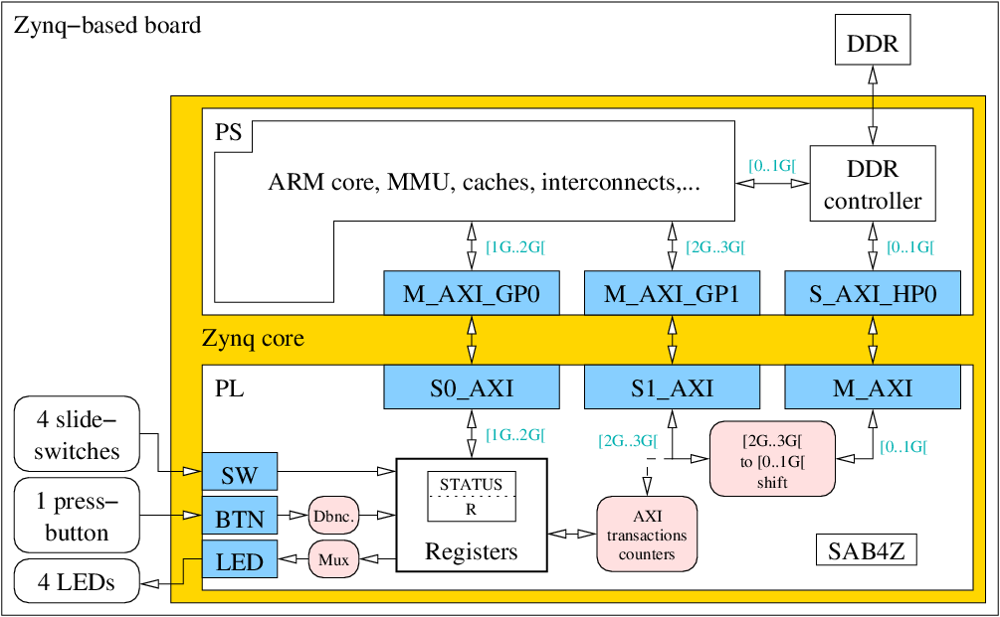
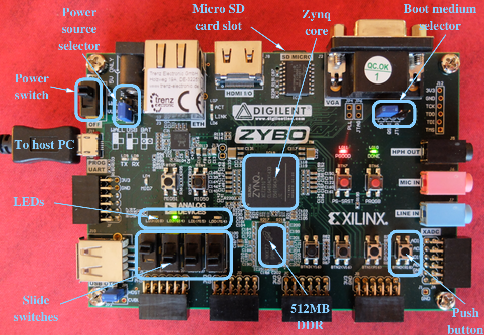

This repository and its sub-directories contain the VHDL source code, VHDL simulation environment, simulation scripts, synthesis scripts and companion example software for SAB4Z, a simple design example for the Xilinx Zynq core. It can be ported on any board based on Xilinx Zynq cores but has been specifically designed for the Zybo board by Digilent, the ZedBoard and the Xilinx ZC706 board.

All provided instructions are for a host computer running a GNU/Linux operating system and have been tested on a Debian 8 (jessie) distribution. Porting to other GNU/Linux distributions should be very easy. If you are working under Microsoft Windows or Apple Mac OS X, installing a virtualization framework and running a Debian OS in a virtual machine is probably the easiest path.

Please signal errors and send suggestions for improvements to renaud.pacalet@telecom-paristech.fr.

# Table of content
* [License](#License)
* [Content](#Content)
* [Description](#Description)
* [Install from the archive](#Archive)
* [Test SAB4Z on the Zybo](#Run)
* [Build everything from scratch](#Build)
    * [Downloads](#BuildDownloads)
    * [Hardware synthesis](#BuildSynthesis)
    * [Build a cross-compilation toolchain](#BuildToolChain)
    * [Build a root file system](#BuildRootFs)
    * [Build the Linux kernel](#BuildKernel)
    * [Build U-Boot](#BuildUboot)
    * [Build the hardware dependant software](#BuildHwDepSw)
* [Going further](#Further)
    * [Set up a network interface on the Zybo](#FurtherNetwork)
    * [Create a local network between host and Zybo](#FurtherDnsmasq)
    * [Transfer files from host PC to Zybo without a network interface](#FurtherFileTransfer)
    * [Run a user application on the Zybo](#FurtherUserApp)
    * [Debug a user application with gdb](#FurtherUserAppDebug)
    * [Access SAB4Z from a user application on the Zybo](#FurtherSab4zApp)
    * [Add a Linux driver for SAB4Z](#FurtherSab4zLinuxDriver)
    * [Run the complete software stack across SAB4Z](#FurtherRunAcrossSab4z)
    * [Debug hardware using ILA](#FurtherIla)
* [Frequently Asked Questions (FAQ)](#FAQ)
    * [Terminal emulator: FATAL: cannot open /dev/ttyUSB1: Permission denied](#FAQ_CharDevAccessRights)
    * [Terminal emulator: launches normally but looks frozen](#FAQ_TerminalEmulatorFrozen)
    * [Git: server certificate verification failed](#FAQ_ServerCertificate)
    * [Hardware synthesis: ERROR: \[Board 49-71\] The board_part definition was not found for digilentinc.com:zybo:part0:1.0](#FAQ_ZyboBoardNotFound)
    * [Buildroot: You seem to have the current working directory in your LD\_LIBRARY\_PATH environment variable. This doesn't work.](#FAQ_BUILDROOTLD_LIBRARY_PATH)
    * [Buildroot: You seem to have the current working directory in your PATH environment variable. This doesn't work.](#FAQ_BUILDROOTPATH)
    * [U-Boot: fatal error: openssl/evp.h: No such file or directory](#FAQ_UbootEvp)
    * [How can I change the Ethernet MAC address of the Zybo?](#FAQ_ChangeEthAddr)
    * [What value should I use for the `-j` make option?](#FAQ_Ncore)
    * [Vivado: ERROR: \[Labtoolstcl 44-26\] No hardware targets exist on the server \[localhost\]](#FAQ_HWTargetNotFound)
* [Glossary](#Glossary)

# <a name="License"></a>License

Copyright Telecom ParisTech  
Copyright Renaud Pacalet (renaud.pacalet@telecom-paristech.fr)

Licensed uder the CeCILL license, Version 2.1 of
2013-06-21 (the "License"). You should have
received a copy of the License. Else, you may
obtain a copy of the License at:

http://www.cecill.info/licences/Licence_CeCILL_V2.1-en.txt

# <a name="Content"></a>Content

    .
    ├── archives                  Archives
    │   └── sdcard.tgz            Archive to unpack on MicroSD card
    ├── C                         C source code
    │   ├── hello_world.c         Simple example user application
    │   ├── libsab4z.c            User-space part of Linux driver
    │   ├── libsab4z.h            User-space part of Linux driver (header)
    │   ├── Makefile              Makefile for software
    │   ├── sab4z.c               User application using SAB4Z
    │   ├── sab4z_driver.c        Kernel-space part of Linux driver
    │   ├── sab4z_driver.h        Kernel-space part of Linux driver (header)
    │   └── test_sab4z_driver.c   Linux driver test application
    ├── COPYING                   License (English version)
    ├── COPYING-FR                Licence (version française)
    ├── COPYRIGHT                 Copyright notice
    ├── hdl                       VHDL source code
    │   ├── axi_pkg.vhd           Package of AXI definitions
    │   ├── debouncer.vhd         Debouncer-resynchronizer
    │   └── sab4z.vhd             Top-level SAB4Z
    ├── images                    Figures
    │   ├── sab4z.fig             SAB4Z in Zynq
    │   ├── sab4z.png             PNG export of sab4z.fig
    │   └── zybo.png              Zybo board picture
    ├── Makefile                  Main makefile
    ├── README.md                 This file
    └── scripts                   Scripts
        ├── boot.bif              Zynq Boot Image description File
        ├── dts.tcl               TCL script for device tree generation
        ├── fsbl.tcl              TCL script for FSBL generation
        ├── ila.tcl               TCL script for ILA debug cores
        ├── uEnv.txt              Definitions of U-Boot environment variables
        └── vvsyn.tcl             Vivado TCL synthesis script

# <a name="Description"></a>Description

**SAB4Z** is a **S**imple **A**xi-to-axi **B**ridge **F**or **Z**ynq cores with a lite [AXI](#GlossaryAxi) slave port (S0_AXI) an [AXI](#GlossaryAxi) slave port (S1_AXI), a master [AXI](#GlossaryAxi) port (M_AXI), two internal registers (STATUS and R), a 4-bits input (SW), a 4-bits output (LED) and a one-bit command input (BTN). Its VHDL synthesizable model is available in the `hdl` sub-directory. The following figure represents SAB4Z mapped in the Programmable Logic (PL) of the Zynq core.



SAB4Z is connected to the Processing System (PS) of the Zynq core by the 3 [AXI](#GlossaryAxi) ports. When the ARM processor of the PS reads or writes at addresses in the `[0..1G[` range (first giga byte) it accesses the DDR memory of the board (512MB on Zybo and ZedBoard, 1GB on ZC706), directly through the DDR controller. In the following we will refer to this range as the _Regular Memory Address Space_ (RMAS). When the addresses fall in the `[1G..2G[` or `[2G..3G[` ranges, it accesses SAB4Z, through its S0_AXI and S1_AXI ports, respectively. SAB4Z can also access the DDR in the `[0..1G[` range, thanks to its M_AXI port.

## Memory address spaces

As shown on the figure, the accesses from the PS that fall in the `[2G..3G[` range (S1_AXI) are forwarded to M_AXI with an address down-shift from `[2G..3G[` to `[0..1G[`. The responses from M_AXI are forwarded back to S1_AXI. This path is thus a second way to access the `[0..1G[` range from the PS, across the PL. From the PS viewpoint each address in the `[0..1G[` range has an equivalent address in the `[2G..3G[` range. In the following we will refer to this range as the _Alternate Memory Address Space_ (AMAS).

**Important remark**: there is one important limitation to this one-to-one address equivalence between the RMAS and the AMAS. Zynq cores have a reserved low addresses range that cannot be accessed from the PL. In our case this low range is the first 512kB (`[0..512k[`). As a consequence, the low 512kB of DDR (`[0..512k[`) can be accessed directly by the processor in the RMAS, but not in the supposedly equivalent AMAS, because it would be down-shifted to `[0..512k[` by SAB4Z before forwarding the access to the M_AXI port, and errors would be raised.

**Important remark**: the M_AXI port that SAB4Z uses to access the DDR is not cache-coherent and the `[2G..3G[` range is, by default, not cacheable. There is thus a second limitation to the equivalence between RMAS and AMAS and reading or writing in the AMAS is thus not exactly the same as reading or writing in RMAS.

**Important remark**: the Zybo and ZedBoard boards have only 512MB of DDR (while the ZC706 has 1GB), but the way the DDR chips are connected to the Zynq core aliases the `[512M..1G[` range to the `[0..512M[` range. Each DDR location can thus be accessed directly by the processor with 2 different addresses in RMAS: one in the `[0..512M[` range and the other in the  `[512M..1G[` range. As a consequence, there is a very simple workaround for the previously mentioned limitation about the first 512kB, which is to access the DDR through SAB4Z in the PL using the `[2G+512M..3G[` range instead of `[2G..2G+512M[`. The addresses will be first down-shifted to `[512M..1G[` before being forwarded to the M_AXI port, and finally aliased to `[0..512M[` by the routing of the board. We will use this property in the [Run the complete software stack across SAB4Z](#FurtherRunAcrossSab4z) part of this tutorial. On the ZC706 board, however, the limitation is unavoidable and the first 512kB of the 1GB DDR cannot be accessed by the processor in the AMAS.

**Important remark**: last but not least, randomly modifying the content of the memory using the AMAS can crash the system or lead to unexpected behaviours if the modified region is currently in use by the currently running software stack.

## Control address space

As shown on the figure, the `[1G..2G[` address space, referred to as _Control Address Space_ (CAS) in the following, is mapped to the S0_AXI [AXI](#GlossaryAxi) slave port. In SAB4Z, it is used to access the internal registers. The mapping of the CAS address space is the following:

| Address       | Mapping     | Description                                 | 
| :------------ | :---------- | :------------------------------------------ | 
| `0x4000_0000` | STATUS (ro) | 32 bits read-only status register           | 
| `0x4000_0004` | R      (rw) | 32 bits general purpose read-write register | 
| `0x4000_0008` | Unmapped    |                                             | 
| ...           | ...         |                                             | 
| `0x7fff_fffc` | Unmapped    |                                             | 

Accesses to the unmapped region of the CAS (`[1G+8..2G[`) raise DECERR [AXI](#GlossaryAxi) errors. Write accesses to the read-only STATUS register raise SLVERR [AXI](#GlossaryAxi) errors.

The two registers are subdivided in 16 four-bits nibbles, indexed from 0, for the 4 Least Significant Bits (LSBs) of STATUS, to 15, for the 4 Most Significant Bits (MSBs) of R. The organization of the registers is the following:

| Register | Nibble | Bits     | Field name | Role                                          |
| :------- | -----: | -------: | :--------- | :-------------------------------------------- |
| STATUS   |      0 |  `3...0` | LIFE       | Rotating bit (life monitor)                   |
| ...      |      1 |  `7...4` | CNT        | Counter of BTN rising edges                   |
| ...      |      2 | `11...8` | ARCNT      | Counter of S1_AXI address-read transactions   |
| ...      |      3 | `15..12` | RCNT       | Counter of S1_AXI data-read transactions      |
| ...      |      4 | `19..16` | AWCNT      | Counter of S1_AXI address-write transactions  |
| ...      |      5 | `23..20` | WCNT       | Counter of S1_AXI data-write transactions     |
| ...      |      6 | `27..24` | BCNT       | Counter of S1_AXI write-response transactions |
| STATUS   |      7 | `31..28` | SW         | Current configuration of SW input             |
| R        |      8 |   `3..0` | R0         | General purpose                               |
| ...      |    ... | ...      | ...        | ...                                           |
| R        |     15 | `31..28` | R7         | General purpose                               |

CNT is a 4-bits counter. It is initialized to zero after reset. Each time there is a rising edge on the BTN input, CNT is incremented (modulus 16). When BTN is high, the 4-bits LED output is driven by CNT (a way to check the current value of the counter). When BTN is low, the 4-bits LED output is driven by nibble number CNT. The BTN input is filtered by a debouncer-resynchronizer before being used to increment CNT.

## IO mapping

The mapping of the SAB4Z inputs and outputs on board instances depends on the target board. On the Zybo, for example, the 4-bits SW input, the BTN input and the 4-bits LED output of SAB4Z are connected to the 4 slide switches (SW0, SW1, SW2, SW3), the rightmost push-button (BTN0) and the 4 LEDs (LD0, LD1, LD2, LD3), respectively. The following figure represents the Zybo board:



The following table summarizes the IO mapping for the currently supported boards:

| Board    | IO   | Board instances                           |
| :------- | :--- | :---------------------------------------- |
| Zybo     | SW   | SW0-SW3 (4 user slide switches)           |
| Zybo     | BTN  | BTN0 (rightmost user push-button)         |
| Zybo     | LED  | LD0-LD3 (4 user LEDs)                     |
| ZedBoard | SW   | SW0-SW3 (4 rightmost user slide switches) |
| ZedBoard | BTN  | BTNR (right push-button of 5-buttons pad) |
| ZedBoard | LED  | LD0-LD3 (4 rightmost user LEDs)           |
| ZC706    | SW   | SW12 (4 DIP switches)                     |
| ZC706    | BTN  | SW8 (rightmost user push-button)          |
| ZC706    | LED  | DS8-DS10, DS35 (4 user LEDs)              |

# <a name="Archive"></a>Installing SAB4Z from the archive

In the following example code blocks we will use different prompts for the different contexts:

* `Host>` is the shell prompt of the regular user (you) on the host PC.
* `Host-Xilinx>` is the prompt of the regular user (you) on the host PC, for the shell that has been configured to use Xilinx tools: the Xilinx initialization script redefines the LD\_LIBRARY\_PATH environment variable to point to Xilinx shared libraries. A consequence is that many utilities of your host PC cannot be used any more from this shell without crashing with more or less accurate error messages. To avoid this, run the Xilinx tools, and only them, in a separate, dedicated shell.
* `Host#` is the shell prompt of the root user on the host PC (some actions must be run as root on the host).
* `Zynq>` is the [U-Boot](http://www.denx.de/wiki/U-Boot) prompt on the Zybo board (more on [U-Boot](http://www.denx.de/wiki/U-Boot) later).
* `Sab4z>` is the shell prompt of the root user on the Zybo board (the only one we will use on the Zybo).

Download the archive, insert a MicroSD card in your card reader and unpack the archive to it:

    Host> cd /tmp
    Host> wget https://gitlab.eurecom.fr/renaud.pacalet/sab4z/raw/master/archives/sdcard.tgz
    Host> tar -C <path-to-mounted-sd-card> -xf sdcard.tgz
    Host> sync
    Host> umount <path-to-mounted-sd-card>

Eject the MicroSD card.

# <a name="Run"></a>Test SAB4Z on the Zybo

* Plug the MicroSD card in the Zybo and connect the USB cable.
* Check the position of the jumper that selects the power source (USB or power adapter).
* Check the position of the jumper that selects the boot medium (MicroSD card).
* Power on. Two new [character devices](#GlossaryFt2232hCharDev) should show up (`/dev/ttyUSB0` and `/dev/ttyUSB1` by default) on the host PC. `/dev/ttyUSB1` is the one corresponding to the serial link with the Zybo.
* Launch a [terminal emulator](#GlossaryTerminalEmulator) (picocom, minicom...) and attach it to the new [character device](#GlossaryFt2232hCharDev), with a 115200 baudrate, no flow control, no parity, 8 bits characters, no port reset and no port locking: `picocom -b115200 -fn -pn -d8 -r -l /dev/ttyUSB1`.
* Wait until [Linux](#GlossaryLinuxKernel) boots, log in as root (there is no password) and start interacting with SAB4Z.

<!-- -->
    Host> picocom -b115200 -fn -pn -d8 -r -l /dev/ttyUSB1
    ...
    Welcome to SAB4Z (c) Telecom ParisTech
    sab4z login: root
    Sab4z>

### <a name="RunReadStatus"></a>Read the STATUS register (address `0x4000_0000`)

To access the SAB4Z memory spaces you can use devmem, a [Busybox](https://www.busybox.net/) utility that allows to access memory locations with their physical addresses. It is privileged but as we are root... Let us first read the content of the 32-bits status register at address `0x4000_0000`:

    Sab4z> devmem 0x40000000 32
    0x00000004
    Sab4z> devmem 0x40000000 32
    0x00000002
    Sab4z> devmem 0x40000000 32
    0x00000008

As can be seen, the content of the STATUS register is all zeroes, except its 4 LSBs, the life monitor, that spin with a period of about half a second and thus take different values depending on the exact instant of reading. The CNT counter is zero, so the LEDs are driven by the life monitor. Change the configuration of the 4 slide switches, read again the STATUS register and check that the 4 MSBs reflect the chosen configuration:

    Sab4z> devmem 0x40000000 32
    0x50000002

### <a name="RunReadWriteR"></a>Read and write the R register (address `0x4000_0004`)

    Sab4z> devmem 0x40000004 32
    0x00000000
    Sab4z> devmem 0x40000004 32 0x12345678
    Sab4z> devmem 0x40000004 32
    0x12345678

### <a name="RunReadDDR"></a>Read DDR locations

    Sab4z> devmem 0x01000000 32
    0x4D546529
    Sab4z> devmem 0x81000000 32
    0x4D546529
    Sab4z> devmem 0x40000000 32
    0x50001104

As expected, the `0x0100_0000` and `0x8100_0000` addresses store the same value (but things could be different if `0x0100_0000` was cached in a write-back cache and was dirty...) ARCNT and RCNT, the counters of address read and data read [AXI](#GlossaryAxi) transactions on [AXI](#GlossaryAxi) slave port S1_AXI, have been incremented because we performed a read access to the DDR at `0x8100_0000`. Let us write a DDR location, for instance `0x8200_0000`, but as we do not know whether the equivalent `0x0200_0000` is currently used by the running software stack, let us first read it and overwrite with the same value:

    Sab4z> devmem 0x82000000 32
    0xEDFE0DD0
    Sab4z> devmem 0x82000000 32 0xEDFE0DD0
    Sab4z> devmem 0x40000000 32
    0x51112204

The read counters have again been incremented because of the read access at `0x8200_0000`. The 3 write counters (AWCNT, WCNT and BCNT) have also been incremented by the write access at `0x8200_0000`.

### <a name="RunPushButton"></a>Press the push-button, select LED driver

If we press the push-button and do not release it yet, the LEDs display `0001`, the new value of the incremented CNT. If we release the button the LEDs still display `0001` because when CNT=1 their are driven by... CNT. Press and release the button once more and check that the LEDs display `0010`, the current value of ARCNT. Continue exploring the 16 possible values of CNT and check that the LEDs display what they should.

### <a name="RunHalt"></a>Halt the system

Always halt properly before switching the power off:

    Sab4z> poweroff
    Sab4z> Stopping network...Saving random seed... done.
    Stopping logging: OK
    umount: devtmpfs busy - remounted read-only
    umount: can't unmount /: Invalid argument
    The system is going down NOW!
    Sent SIGTERM to all processes
    Sent SIGKILL to all processes
    Requesting system poweroff
    reboot: System halted

# <a name="Build"></a>Build everything from scratch

The embedded system world sometimes looks overcomplicated to non-specialists. But most of this complexity comes from the large number of small things that make this world, not really from the complexity of these small things themselves. Understanding large portions of this exciting field is perfectly feasible, even without a strong background in computer sciences. And, of course, doing things alone is probably one of the best ways to understand them. In the following we will progressively build a complete computer system based on a Zynq-based board, with custom hardware extensions, and running a GNU/Linux operating system.

You will need the Xilinx tools (Vivado and its companion SDK). The version that we used when designing this tutorial was `2016.3`. More recent versions should be OK but may require small modifications of the `scripts/vvsyn.tcl` synthesis script. In the following we assume that the Xilinx tools are properly installed.

You will also need to download, configure and build several free and open source software. For each of them we will indicate the version that we used. More recent versions will probably be OK, at the price of minor changes there and there. In order to avoid difficulties with unstable versions of the tools, it is strongly advised to have a look at the tags, select a recent but stable one, create a local branch with the selected tag checked out and use it instead of the tip of the default branch. Example for `crosstool-NG`:

    Host> cd /some/where/crosstool-ng
    Host> git tag
    ...
    crosstool-ng-1.22.0
    ...
    Host> git checkout crosstool-ng-1.22.0
    Host> git checkout -b mybranch-1.22.0

The clones of some git repositories and the directories in which we will build some components can be very large (several GB). Carefully select where to install them.

Some steps can be run in parallel because they do not depend on the results of other steps. Some steps cannot be started before others finish and this will be signalled.

The instructions introduce new concepts one after the other, with the advantage that for any given goal the number of actions to perform is limited and each action is easier to understand. The drawback is that, each time we introduce a new concept, we will have to reconfigure, rebuild and reinstall one or several components. In certain circumstances (like, for instance, when reconfiguring the [Buildroot](https://buildroot.org/) tool chain) such a move will take several minutes or even worse. Just the once will not hurt, the impatient should thus read the complete document before she starts following the instructions.

In the following we download all components in subdirectories of `/opt/downloads` and build in subdirectories of `/opt/builds`. Adapt to your own situation.

## <a name="BuildSynthesis"></a>Hardware synthesis

Clone the SAB4Z git repository:

    Host> mkdir -p /opt/downloads /opt/builds
    Host> cd /opt/downloads
    Host> git clone https://gitlab.eurecom.fr/renaud.pacalet/sab4z.git

The hardware synthesis produces a bitstream file from the VHDL source code in `hdl/`. It is done by the Xilinx Vivado tools. SAB4Z comes with a `Makefile` (that defines a `help` goal) and a `scripts/vvsyn.tcl` synthesis script to automate the synthesis:

    Host-Xilinx> cd /opt/downloads/sab4z
    Host-Xilinx> make help
    Host-Xilinx> make VVBUILD=/opt/builds/vv VVBOARD=zybo vv-all

(replace `VVBOARD=zybo` by `VVBOARD=zed` or `VVBOARD=zc706` if your board is not the Zybo).

The generated bitstream is `/opt/builds/vv/top.runs/impl_1/top_wrapper.bit`. This binary file is used to configure the FPGA part of the Zynq core of the board such that it implements our VHDL design. A binary description of our hardware design is also available in `/opt/builds/vv/top.runs/impl_1/top_wrapper.sysdef`. It is not human-readable but we will use it later to generate the [device tree](#GlossaryDeviceTree) sources and the [First Stage Boot Loader](#GlossaryFsbl) (FSBL) sources.

## <a name="BuildToolChain"></a>Build a cross-compilation toolchain

In order to compile and link software components on our host computer (X86 architecture) but run them on the target board (ARM architecture) we need a cross-compilation toolchain. We can use an existing one, like the one that comes with the Xilinx tools (in the `gnu/arm/lin` subdirectory of the Xilinx SDK installation directory) or download one from one of many providers (e.g. [Linaro](https://www.linaro.org/downloads/)). The good point with this approach is that it is simpler and faster than building a toolchain from scratch. The drawback is that we cannot tune the toolchain and that we do not learn how to build a toolchain. We can also let [Buildroot](https://buildroot.org/) build a toolchain but it is not the recommended way because it would have to be redone each time we change some important parameters of the [Buildroot](https://buildroot.org/) configuration. And building a toolchain takes time. The best option is to use [crosstool-NG](http://crosstool-ng.org/) and build our own toolchain from scratch, once for all.

Let us first clone, compile and install [crosstool-NG](http://crosstool-ng.org/):

    Host> cd /opt/downloads
    Host> git clone http://crosstool-ng.org/git/crosstool-ng
    Host> cd crosstool-ng
    Host> git tag
    ...
    crosstool-ng-1.22.0
    ...
    Host> git checkout crosstool-ng-1.22.0
    Host> git checkout -b mybranch-1.22.0
    Host> ./bootstrap
    Host> ./configure --prefix=/opt/builds
    Host> make -j24
    Host> make install
    Host> export PATH=$PATH:/opt/builds/bin

Next, let us select a toolchain, look at its characteristics, generate its default configuration and adapt it to our needs:

    Host> mkdir -p /opt/builds/tmp
    Host> cd /opt/builds/tmp
    Host> ct-ng list-samples
    ...
    [G..]   arm-unknown-linux-gnueabi
    ...
    Host> ct-ng show-arm-unknown-linux-gnueabi
    ...
    [G..]   arm-unknown-linux-gnueabi
        OS             : linux-4.3
        Companion libs : gmp-6.0.0a mpfr-3.1.3 mpc-1.0.3 libelf-0.8.13 expat-2.1.0 ncurses-6.0
        binutils       : binutils-2.25.1
        C compilers    : gcc  |  5.2.0
        Languages      : C,C++
        C library      : glibc-2.22 (threads: nptl)
        Tools          : dmalloc-5.5.2 duma-2_5_15 gdb-7.10 ltrace-0.7.3 strace-4.10
    ...
    Host> ct-ng arm-unknown-linux-gnueabi

Note the `gcc` version (`5.2.0`) and the Linux kernel headers series (`4.3`), we will need these information later when configuring [Buildroot](https://buildroot.org/). We will now adapt the default configuration to:

1. Load the sources of the tools in `/opt/downloads/crosstool-ng-src
1. Install the built toolchain in `/opt/builds/arm-unknown-linux-gnueabihf` (the `hf` suffix indicates that the toolchain uses the hardware Floating Point Unit of the target ARM processors)
1. Run up to 24 jobs in parallel (see the [What value should I use for the -j make option?](#FAQ_Ncore) FAQ entry and adapt to your own situation)
1. Configure the toolchain to use the hardware Floating Point Unit (FPU) of our target ARM processors
1. Build the toolchain as static (this will allow us to move the toolchain and to run it on other hosts)

Launch the configuration tool:

    Host> ct-ng menuconfig

In the [crosstool-NG](http://crosstool-ng.org/) configuration menus change the following options:

    Paths and misc options ---> Local tarballs directory ---> /opt/downloads/crosstool-ng-src
    Paths and misc options ---> Prefix directory ---> /opt/builds/arm-unknown-linux-gnueabihf
    Paths and misc options ---> Number of parallel jobs ---> 24
    Target options ---> Floating point ---> hardware (FPU)
    Toolchain options ---> Build Static Toolchain

Create the directory for local tarballs and build the toolchain (be very patient, this takes time):

    Host> mkdir -p /opt/downloads/crosstool-ng-src
    Host> ct-ng build

Add the toolchain to your `PATH` and test:

    Host> export PATH=$PATH:/opt/builds/arm-unknown-linux-gnueabihf/bin
    Host> arm-unknown-linux-gnueabihf-gcc --version
    arm-unknown-linux-gnueabihf-gcc (crosstool-NG crosstool-ng-1.22.0) 5.2.0
    Copyright (C) 2015 Free Software Foundation, Inc.
    This is free software; see the source for copying conditions.  There is NO
    warranty; not even for MERCHANTABILITY or FITNESS FOR A PARTICULAR PURPOSE.

That's it. We now have a complete toolchain for 32 bits ARM processors with hardware Floating Point Unit (FPU) support. We can use it on our host PC to compile all software components for our target board. And, of course, we can use it for other ARM-based projects too. We can even build toolchains for other targets (X86, Mips, Sparc...) if needed.

## <a name="BuildRootFs"></a>Build a root file system

Do not start this part before the [toolchain](#BuildToolChain) is built: it is needed.

Just like your host, our Zybo computer needs a root [file system](#GlossaryFileSystem) to run a decent operating system like GNU/Linux. We will use [Buildroot](https://buildroot.org/) to build and populate a [Busybox](https://www.busybox.net/)-based, tiny, [initramfs](#GlossaryInitramfs) root [file system](#GlossaryFileSystem). In other notes we will explore other types of root [file systems](#GlossaryFileSystem) (networked [file systems](#GlossaryFileSystem), [file systems](#GlossaryFileSystem) on the MicroSD card...) but as [initramfs](#GlossaryInitramfs) is probably the simplest of all, let us start with this one.

[Buildroot](https://buildroot.org/) is a very nice and easy to use toolbox dedicated to the creation of root [file systems](#GlossaryFileSystem) for many different target embedded systems. It can also build [Linux kernels](#GlossaryLinuxKernel) and other useful software but we will use it only to generate our root [file system](#GlossaryFileSystem). [Buildroot](https://buildroot.org/) has default configurations for the Zybo board, the ZedBoard and the ZC706 board. First create and prepare a build directory for our root [file systems](#GlossaryFileSystem):

    Host> mkdir -p /opt/builds/rootfs
    Host> cd /opt/builds/rootfs
    Host> touch external.mk Config.in
    Host> echo 'name: sab4z' > external.desc
    Host> echo 'desc: sab4z system with buildroot' >> external.desc
    Host> mkdir -p configs overlays

Then, clone [Buildroot](https://buildroot.org/) and use it to create a default configuration in `/opt/builds/rootfs` for our board:

    Host> cd /opt/downloads
    Host> git clone http://git.buildroot.net/git/buildroot.git
    Host> cd buildroot
    Host> git tag
    ...
    2016.11.1
    ...
    Host> git checkout 2016.11.1
    Host> git checkout -b mybranch-2016.11.1
    Host> make BR2_EXTERNAL=/opt/builds/rootfs O=/opt/builds/rootfs zynq_zybo_defconfig

(replace `zynq_zybo_defconfig` by `zynq_zed_defconfig` or `zynq_zc706_defconfig` to reflect your own board).

Let us now customize the default configuration to:

1. Save the configuration in `/opt/builds/rootfs/configs/sab4z_defconfig`
1. Download all needed software packages in `/opt/downloads/buildroot-src`,
1. Run up to 24 jobs in parallel (see the [What value should I use for the -j make option?](#FAQ_Ncore) FAQ entry and adapt to your own situation)
1. Use a compiler cache (faster build),
1. Put the compiler cache in `/opt/builds/buildroot-ccache`,
1. Use the [toolchain](#BuildToolChain) we built with [crosstool-NG](http://crosstool-ng.org/)
1. Customize the host name,
1. Customize the welcome banner,
1. Specify an overlay directory (a convenient way to customize the built root [file system](#GlossaryFileSystem)) in `/opt/builds/rootfs/overlays`,
1. Skip [Linux kernel](#GlossaryLinuxKernel) build (we will use the [Linux kernel](#GlossaryLinuxKernel) from the Xilinx git repository),
1. Skip [U-Boot](http://www.denx.de/wiki/U-Boot) build (we will use the [U-Boot](http://www.denx.de/wiki/U-Boot) from the Xilinx git repository).

Launch the configuration tool:

    Host> cd /opt/builds/rootfs
    Host> make menuconfig

In the [Buildroot](https://buildroot.org/) configuration menus change the following options:

    Build options ---> Location to save buildroot config ---> /opt/builds/rootfs/configs/sab4z_defconfig
    Build options ---> Download dir ---> /opt/downloads/buildroot-src
    Build options ---> Number of jobs to run simultaneously ---> 24
    Build options ---> Enable compiler cache ---> yes
    Build options ---> Compiler cache location ---> /opt/builds/buildroot-ccache
    Toolchain ---> Toolchain type ---> External toolchain
    Toolchain ---> Toolchain ---> Custom toolchain
    Toolchain ---> Toolchain origin ---> Pre-installed toolchain
    Toolchain ---> Toolchain path ---> /opt/builds/arm-unknown-linux-gnueabihf
    Toolchain ---> Toolchain prefix ---> arm-unknown-linux-gnueabihf
    Toolchain ---> External toolchain gcc version ---> 5.x
    Toolchain ---> External toolchain kernel headers series ---> 4.3.x
    Toolchain ---> External toolchain C library ---> glibc/eglibc
    Toolchain ---> Toolchain has SSP support? ---> yes
    Toolchain ---> Toolchain has RPC support? ---> yes
    Toolchain ---> Toolchain has C++ support? ---> yes
    System configuration ---> System hostname ---> sab4z
    System configuration ---> System banner ---> Welcome to SAB4Z (c) Telecom ParisTech
    System configuration ---> Root filesystem overlay directories ---> /opt/builds/rootfs/overlays
    Kernel ---> Linux Kernel ---> no
    Bootloaders ---> U-Boot ---> no

Save the configuration:

    Host> make savedefconfig

The overlay directory that we specified will be incorporated in the root [file system](#GlossaryFileSystem). It is anchored to the root directory of the root [file system](#GlossaryFileSystem), that is, any file or directory located at the root of the overlay directory will be located at the root of the [file system](#GlossaryFileSystem). Let us start populating it with a simple shell script that changes the default shell prompt:

    Host> cd /opt/builds/rootfs
    Host> mkdir -p overlays/etc/profile.d
    Host> echo "export PS1='Sab4z> '" > overlays/etc/profile.d/prompt.sh

Finally, build the root [file system](#GlossaryFileSystem):

    Host> make

The first build takes some time but most of the work will not have to be redone if we later make minor changes to the configuration and rebuild. The generated root [file system](#GlossaryFileSystem) is available in different formats:

* `/opt/builds/rootfs/images/rootfs.tar` is a tar archive that we can explore with the tar utility. This is left as an exercise for the reader.
* `/opt/builds/rootfs/images/rootfs.cpio` is the same but in cpio format (another archive format).
* `/opt/builds/rootfs/images/rootfs.cpio.gz` is the compressed version of `/opt/builds/rootfs/images/rootfs.cpio`.
* Finally, `/opt/builds/rootfs/images/rootfs.cpio.uboot` is the same as `/opt/builds/rootfs/images/rootfs.cpio.gz` with a 64 bytes header added. As its name says, this last form is intended for use with the [U-Boot](http://www.denx.de/wiki/U-Boot) boot loader and the added header is for [U-Boot](http://www.denx.de/wiki/U-Boot) use. More on [U-Boot](http://www.denx.de/wiki/U-Boot) later. This version is thus the root [file system](#GlossaryFileSystem) image that we will store on the MicroSD card and use on the Zybo, but is it not yet the final version. We still have a few things to add to the overlays.

The shell script that we added to the overlay (`/opt/builds/rootfs/overlays/etc/profile.d/prompt.sh`) can be found at `/etc/profile.d/prompt.sh` in the generated root [file system](#GlossaryFileSystem):

    Host> tar tf /opt/builds/rootfs/images/rootfs.tar | grep prompt
    ./etc/profile.d/prompt.sh

[Buildroot](https://buildroot.org/) also built applications for the host PC that we will need later:

* dtc, a [device tree](#GlossaryDeviceTree) compiler (more on this later),
* mkimage, a utility used to create images for [U-Boot](http://www.denx.de/wiki/U-Boot) (and that the build system used to create `/opt/builds/rootfs/images/rootfs.cpio.uboot`).

They are in `/opt/builds/rootfs/host/usr/bin`. [Buildroot](https://buildroot.org/) also copied our [toolchain](#BuildToolChain) in `/opt/builds/rootfs/host/usr`. Add `/opt/builds/rootfs/host/usr/bin` to your PATH and define the `CROSS_COMPILE` environment variable (note the trailing hyphen):

    Host> export PATH=$PATH:/opt/builds/rootfs/host/usr/bin
    Host> export CROSS_COMPILE=arm-unknown-linux-gnueabihf-

## <a name="BuildKernel"></a>Build the Linux kernel

Do not start this part before the [toolchain](#BuildToolChain) is built: it is needed.

Let us first clone the [Linux kernel](#GlossaryLinuxKernel) and create a default configuration for our target in `/opt/builds/kernel`:

    Host> cd /opt/downloads
    Host> git clone https://github.com/Xilinx/linux-xlnx.git
    Host> cd linux-xlnx
    Host> git tag
    ...
    xilinx-v2016.3
    ...
    Host> git checkout xilinx-v2016.3
    Host> git checkout -b mybranch-xilinx-v2016.3
    Host> make O=/opt/builds/kernel ARCH=arm xilinx_zynq_defconfig

Then, build the [kernel](#GlossaryLinuxKernel):

    Host> cd /opt/builds/kernel
    Host> make -j24 ARCH=arm

Just like [Buildroot](https://buildroot.org/), the [Linux kernel](#GlossaryLinuxKernel) build system offers a way to tune the default configuration before building:

    Host> cd /opt/builds/kernel
    Host> make ARCH=arm menuconfig
    Host> make -j24 ARCH=arm

As for the root [file system](#GlossaryFileSystem), the [kernel](#GlossaryLinuxKernel) is available in different formats:

* `/opt/builds/kernel/vmlinux` is an uncompressed executable in ELF format,
* `/opt/builds/kernel/arch/arm/boot/zImage` is a compressed executable.

And just like for the root [file system](#GlossaryFileSystem), none of these is the one we will use on the Zybo. In order to load the [kernel](#GlossaryLinuxKernel) in memory with [U-Boot](http://www.denx.de/wiki/U-Boot) we must generate a [kernel](#GlossaryLinuxKernel) image in [U-Boot](http://www.denx.de/wiki/U-Boot) format. This can be done using the [Linux kernel](#GlossaryLinuxKernel) build system. We just need to provide the load address and entry point that [U-Boot](http://www.denx.de/wiki/U-Boot) will use when loading the [kernel](#GlossaryLinuxKernel) into memory and when jumping into the [kernel](#GlossaryLinuxKernel):

    Host> cd /opt/builds/kernel
    Host> make ARCH=arm LOADADDR=0x8000 uImage

The result is in `/opt/builds/kernel/arch/arm/boot/uImage` and, as its size shows, it is the same as `/opt/builds/kernel/arch/arm/boot/zImage` with a 64 bytes [U-Boot](http://www.denx.de/wiki/U-Boot) header added:


    Host> cd /opt/builds/kernel
    Host> ls -l arch/arm/boot/zImage arch/arm/boot/uImage
    -rw-r--r-- 1 mary users 3750312 Apr 11 13:09 arch/arm/boot/uImage
    -rwxr-xr-x 1 mary users 3750248 Apr 11 12:08 arch/arm/boot/zImage

The 64 bytes header, among other parameters, contains the load address and entry point we specified (the two 32-bits words starting at address `0x20`, in little endian order):

    Host> od -N64 -tx4 arch/arm/boot/uImage
    0000000 56190527 ae382b10 e1850b57 68393900
    0000020 00800000 00800000 5845016d 00020205
    0000040 756e694c 2e342d78 2d302e34 696c6978
    0000060 332d786e 35353534 6137672d 66333030
    0000100

When loading the [kernel](#GlossaryLinuxKernel), [U-Boot](http://www.denx.de/wiki/U-Boot) will copy the archive somewhere in memory, parse the 64 bytes header, uncompress the [kernel](#GlossaryLinuxKernel) and install it starting at address `0x8000`, add some more information in the first 32 kB of memory and jump at the entry point, which is also `0x8000`. This [kernel](#GlossaryLinuxKernel) image is thus the one we will store on the MicroSD card and use on the Zybo.

The [kernel](#GlossaryLinuxKernel) embeds a collection of software device drivers that are responsible for the management of the various hardware devices (network interface, timer, interrupt controller...) Some are integrated into the [kernel](#GlossaryLinuxKernel), some are delivered as _external modules_, a kind of device driver that is dynamically loaded in memory by the [kernel](#GlossaryLinuxKernel) when it is needed. These external modules must also be built and installed in our root [file system](#GlossaryFileSystem) where the [kernel](#GlossaryLinuxKernel) will find them, that is, in `/lib/modules`. The [Buildroot](https://buildroot.org/) overlays directory is the perfect way to embed the [kernel](#GlossaryLinuxKernel) modules in the root [file system](#GlossaryFileSystem). Of course, we will have to rebuild the root [file system](#GlossaryFileSystem) but this should be very fast.

    Host> cd /opt/builds/kernel
    Host> make -j24 ARCH=arm modules
    Host> make ARCH=arm modules_install INSTALL_MOD_PATH=/opt/builds/rootfs/overlays
    Host> cd /opt/builds/rootfs
    Host> make

The root [file system](#GlossaryFileSystem) `/opt/builds/rootfs/images/rootfs.cpio.uboot` now contains the [kernel](#GlossaryLinuxKernel) modules and is complete:

    Host> cd /opt/builds/rootfs
    Host> tar tf images/rootfs.tar ./lib/modules
    ./lib/modules/
    ./lib/modules/4.4.0-xilinx-34555-g7a003fc/
    ./lib/modules/4.4.0-xilinx-34555-g7a003fc/kernel/
    ...
    ./lib/modules/4.4.0-xilinx-34555-g7a003fc/modules.symbols.bin
    ./lib/modules/4.4.0-xilinx-34555-g7a003fc/modules.devname
    ./lib/modules/4.4.0-xilinx-34555-g7a003fc/modules.builtin

## <a name="BuildUboot"></a>Build [U-Boot](http://www.denx.de/wiki/U-Boot)

Do not start this part before the [toolchain](#BuildToolChain) is built: it is needed.

[U-Boot](http://www.denx.de/wiki/U-Boot) is a boot loader that is very frequently used in embedded systems. It runs before the [Linux kernel](#GlossaryLinuxKernel) to:

* initialize the board,
* load the [initramfs](#GlossaryInitramfs) root [file system](#GlossaryFileSystem) image in RAM,
* load the [device tree](#GlossaryDeviceTree) blob in RAM (more on this later),
* load the [Linux kernel](#GlossaryLinuxKernel) image in RAM,
* parse the header of the [Linux kernel](#GlossaryLinuxKernel) image,
* uncompress the [Linux kernel](#GlossaryLinuxKernel) and install it at the load address specified in the header,
* prepare some parameters for the [kernel](#GlossaryLinuxKernel) in CPU registers and in the first 32 kB of memory,
* jump into the [kernel](#GlossaryLinuxKernel) at the specified entry point.

Let us first clone [U-Boot](http://www.denx.de/wiki/U-Boot) and create a default configuration for our board in `/opt/builds/uboot`:

    Host> cd /opt/downloads
    Host> git clone https://github.com/Xilinx/u-boot-xlnx.git
    Host> cd u-boot-xlnx
    Host> git tag
    ...
    xilinx-v2016.3
    ...
    Host> git checkout xilinx-v2016.3
    Host> git checkout -b mybranch-xilinx-v2016.3
    Host> make O=/opt/builds/uboot zynq_zybo_defconfig

(replace `zynq_zybo_defconfig` by `zynq_zed_defconfig` or `zynq_zc706_defconfig` to reflect your own board).

Then, build [U-Boot](http://www.denx.de/wiki/U-Boot):

    Host> cd /opt/builds/uboot
    Host> make -j24

Just like [Buildroot](https://buildroot.org/) and the [Linux kernel](#GlossaryLinuxKernel), the [U-Boot](http://www.denx.de/wiki/U-Boot) build system offers a way to tune the default configuration before building:

    Host> cd /opt/builds/uboot
    Host> make menuconfig
    Host> make -j24

Again, the result of [U-Boot](http://www.denx.de/wiki/U-Boot) build is available in different formats. The one we are interested in and that we will use on the Zybo is the executable in ELF format, `/opt/builds/uboot/u-boot`. Later, we will glue it together with several other files to create a single _boot image_ file. As the Xilinx bootgen utility that we will use for that insists that its extension is `.elf`, rename it:

    Host> cp /opt/builds/uboot/u-boot /opt/builds/uboot/u-boot.elf

## <a name="BuildHwDepSw"></a>Build the hardware dependant software

Do not start this part before the [hardware synthesis](#BuildSynthesis) finishes finishes and the [toolchain](#BuildToolChain) is built: they are needed.

### <a name="BuildHWDepSWDTS"></a>Linux kernel device tree

SAB4Z comes with a Makefile and a TCL script that automate the generation of device tree sources using the Xilinx hsi utility, the clone of the git repository of Xilinx device trees (`<some-path>/device-tree-xlnx`) and the description of our hardware design that was generated during the hardware synthesis (`/opt/builds/vv/top.runs/impl_1/top_wrapper.sysdef`). First clone the git repository of Xilinx device trees:

    Host> cd /opt/downloads
    Host> git clone http://github.com/Xilinx/device-tree-xlnx.git
    Host> cd device-tree-xlnx
    Host> git tag
    ...
    xilinx-v2016.3
    ...
    Host> git checkout xilinx-v2016.3
    Host> git checkout -b mybranch-xilinx-v2016.3

Generate the default device tree sources for our hardware design for the Zybo:

    Host-Xilinx> cd /opt/downloads/sab4z
    Host-Xilinx> make VVBUILD=/opt/builds/vv DTSBUILD=/opt/builds/dts XDTS=/opt/downloads/device-tree-xlnx dts

The sources are in `/opt/builds/dts`, the top level is `/opt/builds/dts/system.dts`. Have a look at the sources. If needed, edit them before compiling the device tree blob with dtc:

    Host> cd /opt/builds
    Host> dtc -I dts -O dtb -o devicetree.dtb dts/system.dts

### <a name="BuildHWDepSWFSBL"></a>First Stage Boot Loader (FSBL)

Generate the [FSBL](#GlossaryFsbl) sources:

    Host-Xilinx> cd /opt/downloads/sab4z
    Host-Xilinx> make VVBUILD=/opt/builds/vv FSBLBUILD=/opt/builds/fsbl fsbl

The sources are in `/opt/builds/fsbl`. If needed, edit them before compiling the [FSBL](#GlossaryFsbl):

    Host-Xilinx> make -C /opt/builds/fsbl

### <a name="BuildHWDepSWBootImg"></a>Zynq boot image

A Zynq boot image is a file that is read from the boot medium of the Zybo when the board is powered on. It contains the [FSBL](#GlossaryFsbl) ELF, the bitstream and the [U-Boot](http://www.denx.de/wiki/U-Boot) ELF. Generate the Zynq boot image with the Xilinx bootgen utility and the provided boot image description file:

    Host-Xilinx> cd /opt/builds
    Host-Xilinx> bootgen -w -image /opt/downloads/sab4z/scripts/boot.bif -o boot.bin

### <a name="BuildHWDepSWSDCard"></a>Prepare the MicroSD card

Finally, prepare a MicroSD card with a FAT32 first primary partition (8MB minimum), mount it on your host PC, and copy the different components to it. Assuming the MicroSD card is mounted at `/media/SDCARD`:

    Host> sd=/media/SDCARD
    Host> cd /opt/builds
    Host> cp kernel/arch/arm/boot/uImage .
    Host> cp rootfs/images/rootfs.cpio.uboot uramdisk.image.gz
    Host> cp boot.bin devicetree.dtb uImage uramdisk.image.gz $sd
    Host> sync
    Host> umount $sd

Eject the MicroSD card, plug it in the Zybo and power on.

# <a name="Further"></a>Going further

## <a name="FurtherNetwork"></a>Set up a network interface on the Zybo

The serial interface that we use to interact with the Zybo is limited both in terms of bandwidth and functionality. Transferring files between the host and the Zybo, for instance, even if [not impossible](#FurtherFileTransfer) through the serial interface is overcomplicated. This section will show you how to set up a much more powerful and convenient network interface between host and Zybo. In order to do this we will connect the board to a wired network using an Ethernet cable. Note that if you do not have a wired network or if, for security reasons, you cannot use your existing wired network, it is possible to [create a point-to-point Ethernet network between your host and the board](#FurtherDnsmasq).

From now on we consider that the host and the Zybo can be connected on the same wired network. We also consider that the host knows the Zybo under the `sab4z` hostname. The next step is to add `dropbear`, a tiny `ssh` server, to our root [file system](#GlossaryFileSystem) and enable the networking. This will allow us to connect to the Zybo from the host using a `ssh` client.

    Host> cd /opt/builds/rootfs
    Host> make menuconfig

In the [Buildroot](https://buildroot.org/) configuration menus change the following options

    System configuration -> Network interface to configure through DHCP -> eth0
    Target packages -> Networking applications -> dropbear -> yes

By default, for security reasons, the board will reject `ssh` connections for user `root`. Let us copy our host `ssh` public key to the Zybo such that we can connect as `root` on the Zybo, from the host, without password. If you do not have a `ssh` key already, generate one first with `ssh-keygen`. Assuming our public key on the host is `~/.ssh/id_rsa.pub`, add it to the [Buildroot](https://buildroot.org/) overlays and rebuild the root [file system](#GlossaryFileSystem):

    Host> cd /opt/builds/rootfs
    Host> mkdir -p overlays/root/.ssh
    Host> cp ~/.ssh/id_rsa.pub overlays/root/.ssh/authorized_keys
    Host> make

Mount the MicroSD card on your host PC, copy the new root [file system](#GlossaryFileSystem) image on it, unmount and eject the MicroSD card, plug it in the Zybo, power on and try to connect from the host:

    Host> sd=/media/SDCARD
    Host> cd /opt/builds/rootfs
    Host> cp images/rootfs.cpio.uboot $sd/uramdisk.image.gz
    Host> sync
    Host> umount $sd
    Host> ssh root@sab4z
    The authenticity of host 'sab4z (<no hostip for proxy command>)' can't be established.
    ECDSA key fingerprint is d3:c5:2e:05:5d:be:89:42:65:d5:62:45:39:18:41:24.
    Are you sure you want to continue connecting (yes/no)? yes
    Warning: Permanently added 'sab4z' (ECDSA) to the list of known hosts.

A [ECDSA](https://en.wikipedia.org/wiki/Elliptic_Curve_Digital_Signature_Algorithm) host key has been automatically generated on the Zybo, sent back to the host for confirmation and, as we accepted it, has been added to the list of known hosts that we trust (compare the strings after the `ecdsa-sha2-nistp521` token, on the Zybo board and on the host):

    Sab4z> ls /etc/dropbear
    dropbear_ecdsa_host_key
    Sab4z> dropbearkey -y -f /etc/dropbear/dropbear_ecdsa_host_key
    Public key portion is:
    ecdsa-sha2-nistp521 AAAAE2VjZHNhLXNoYTItbmlzdHA1MjEAAAAIbmlzdHA1MjEAAACFBAD8DHs2poUcaCO8H3pQAyFb5JzXe9CW7MZGXTp9C9toKBFcGS2447ROqxN9iLSASklpqF3deRNahRNOTOHMyEOgAgEsi209XSOX+aeNTvxldJG1YfWcVvzJHoaFpayDia69BskoQ+jbqccZhoFiAGejBGrjdhEBroWkCrlfjshJwltEnQ== root@sab4z
    Fingerprint: md5 9b:6a:22:01:87:1e:98:4a:03:43:10:25:9d:59:d9:04

<!-- -->

    Host> tail -1 ~/.ssh/known_hosts
    |1|hoC0OVXZJbRwQnCpSW7i2d6ZexE=|Guc9B8co0pmAWmxp3T7n2i5RPj4= ecdsa-sha2-nistp521 AAAAE2VjZHNhLXNoYTItbmlzdHA1MjEAAAAIbmlzdHA1MjEAAACFBAD8DHs2poUcaCO8H3pQAyFb5JzXe9CW7MZGXTp9C9toKBFcGS2447ROqxN9iLSASklpqF3deRNahRNOTOHMyEOgAgEsi209XSOX+aeNTvxldJG1YfWcVvzJHoaFpayDia69BskoQ+jbqccZhoFiAGejBGrjdhEBroWkCrlfjshJwltEnQ==

Unfortunately, our root [file system](#GlossaryFileSystem) is [initramfs](#GlossaryInitramfs) and thus non persistent across reboot. Next time, a new ECDSA host key will be generated and it will be different, forcing us to delete the old one and add the new one to the `~/.ssh/known_hosts` file on the host. To avoid this, let us copy the generated ECDSA host key to the [Buildroot](https://buildroot.org/) overlays, such that the authentication of the Zybo becomes persistent across reboot. The `dropbear` `ssh` server that runs on the Zybo, when discovering that an ECDSA host key is already present in `/etc/dropbear`, will reuse it instead of creating a new one. Let us use our new network interface to do this:

    Host> cd /opt/builds/rootfs
    Host> mkdir -p overlays/etc/dropbear
    Host> scp root@sab4z:/etc/dropbear/dropbear_ecdsa_host_key overlays/etc/dropbear
    Host> make

We must now copy the new root [file system](#GlossaryFileSystem) image on the MicroSD card. But as we have a working network interface there is no need to eject-mount-copy-eject. Let us first mount the MicroSD card on the root [file system](#GlossaryFileSystem) of the running Zybo:

    Sab4z> mount /dev/mmcblk0p1 /mnt
    Sab4z> ls -al /mnt
    total 7142
    drwxr-xr-x    2 root     root           512 Jan  1 00:00 .
    drwxr-xr-x   17 root     root           400 Apr 14  2016 ..
    -rwxr-xr-x    1 root     root       2627944 Apr 14  2016 boot.bin
    -rwxr-xr-x    1 root     root          9113 Apr 14  2016 devicetree.dtb
    -rwxr-xr-x    1 root     root       3750456 Apr 14  2016 uImage
    -rwxr-xr-x    1 root     root        923881 Apr 14  2016 uramdisk.image.gz

Then, use the network link to transfer the new root [file system](#GlossaryFileSystem) image to the MicroSD card on the Zybo:

    Host> cd /opt/builds
    Host> scp rootfs/images/rootfs.cpio.uboot root@sab4z:/mnt/uramdisk.image.gz

Finally, on the Zybo, unmount the MicroSD card and reboot:

    Sab4z> umount /mnt
    Sab4z> reboot

We should now be able to `ssh` or `scp` from host to Zybo without password, even after rebooting.

## <a name="FurtherDnsmasq"></a>Create a local network between host and Zybo

Under GNU/Linux, [dnsmasq](http://www.thekelleys.org.uk/dnsmasq/doc.html) is a very convenient way to create a point-to-point Ethernet network between your host and the board. It even allows to share the wireless connection of a laptop with the board. To install [dnsmasq](http://www.thekelleys.org.uk/dnsmasq/doc.html) on Debian:

    Host# apt-get install dnsmasq

To configure [dnsmasq](http://www.thekelleys.org.uk/dnsmasq/doc.html) you will need the Ethernet MAC address of your board. Connect the Zybo to the host with the USB cable, power it up, launch your [terminal emulator](#GlossaryTerminalEmulator) and hit a key to stop the [U-Boot](http://www.denx.de/wiki/U-Boot) countdown.

    Host> picocom -b115200 -fn -pn -d8 -r -l /dev/ttyUSB1
    ...
    Hit any key to stop autoboot:  0
    Zynq> printenv ethaddr
    ethaddr=00:0a:35:00:01:81

If you have not been fast enough to stop the [U-Boot](http://www.denx.de/wiki/U-Boot) countdown, simply wait until the [Linux kernel](#GlossaryLinuxKernel) boots, log in as root and type `reboot`.

Note the Ethernet MAC address (`00:0a:35:00:01:81` in our example). Create a [dnsmasq](http://www.thekelleys.org.uk/dnsmasq/doc.html) configuration file for the Zybo (replace the Ethernet MAC address by the one you noted and the interface and IP address by whatever suits you best), add a new entry in `/etc/hosts` and force [dnsmasq](http://www.thekelleys.org.uk/dnsmasq/doc.html) to reload its configuration:

    Host# cat <<! > /etc/dnsmasq.d/sab4z.conf
    interface=eth0
    dhcp-range=10.42.0.129,10.42.0.255,infinite
    dhcp-host=00:0A:35:00:01:81,sab4z,10.42.0.129,infinite
    !
    Host# echo "10.42.0.129    sab4z" >> /etc/hosts
    Host# /etc/init.d/dnsmasq reload

Next, use the network manager of your host to create a new network connection for our small wired local network. Configure it with a fixed IP address (e.g. `10.42.0.254`), set the `netmask` to `255.255.255.0` and the `gateway` to `0.0.0.0`. Enable this new network connection, connect to the Zybo using your [terminal emulator](#GlossaryTerminalEmulator) and enable the network interface:

    Host> picocom -b115200 -fn -pn -d8 -r -l /dev/ttyUSB1
    Sab4z> ifup eth0
    udhcpc (v1.24.2) started
    Sending discover...
    Sending select for 10.42.0.129...
    Lease of 10.42.0.129 obtained, lease time 268435455
    deleting routers
    adding dns 10.42.0.254

Et voilà. You should now be able to `ssh` to the Zybo from you host:

    Host> ssh root@sab4z
    Sab4z> whoami
    root
    Sab4z> hostname
    sab4z

And of course, you can also `scp`:

    Host> scp foo root@sab4z:/tmp
    Host> ssh root@sab4z ls -l /tmp
    ...
    -rw-------    1 root     root             0 Jan  1 00:03 foo
    ...

## <a name="FurtherFileTransfer"></a>Transfer files from host PC to Zybo without a network interface

A network interface should always be preferred to transfer files from the host to the Zybo: it is fast, reliable and it avoids manipulating the delicate MicroSD card. Here are several alternate ways, in case you cannot set up a network interface between your host and the Zybo.

### <a name="FurtherFileTransferSD"></a>Use the MicroSD card

By default the MicroSD card is not mounted on the root [file system](#GlossaryFileSystem) of the Zybo but it can be. This is a way to import / export data or even custom applications to / from the host PC (of course, a network interface is much better). Simply add files to the MicroSD card from the host PC and they will show up on the Zybo once the MicroSD card is mounted. Mount the MicroSD card on your host PC, copy the files to transfer on it, unmount and eject the MicroSD card:

    Host> sd=/media/SDCARD
    Host> cp foo $sd
    Host> umount $sd

Plug the MicroSD card in the Zybo, power on, connect as `root` and mount the MicroSD card:

    Sab4z> mount /dev/mmcblk0p1 /mnt
    Sab4z> ls -al /mnt
    total 7142
    drwxr-xr-x    2 root     root           512 Jan  1 00:00 .
    drwxr-xr-x   17 root     root           400 Apr 14  2016 ..
    -rwxr-xr-x    1 root     root       2627944 Apr 14  2016 boot.bin
    -rwxr-xr-x    1 root     root          9113 Apr 14  2016 devicetree.dtb
    -rwxr-xr-x    1 root     root          1295 Apr 14  2016 foo
    -rwxr-xr-x    1 root     root       3750456 Apr 14  2016 uImage
    -rwxr-xr-x    1 root     root        923881 Apr 14  2016 uramdisk.image.gz

Conversely, of course, you can store a file on the mounted MicroSD card from the Zybo, properly unmount the card, remove it from its slot, mount it on your host PC and copy the file from the MicroSD card to the host PC.

Do not forget to unmount the card properly before shutting down the Zybo. If you do not there is a risk that its content is damaged:

    Sab4z> umount /mnt
    Sab4z> poweroff

### <a name="FurtherFileTransferOverlays"></a>Add custom files to the root file system

Another possibility is offered by the overlay feature of [Buildroot](https://buildroot.org/) which allows to embed custom files in the generated root [file system](#GlossaryFileSystem). Add the files to transfer to the overlay and rebuild the root [file system](#GlossaryFileSystem):

    Host> cd /opt/builds/rootfs
    Host> mkdir -p overlays/tmp
    Host> cp foo overlays/tmp
    Host> make

Mount the MicroSD card on your host PC, copy the new root [file system](#GlossaryFileSystem) image on it:

    Host> sd=/media/SDCARD
    Host> cp /opt/builds/rootfs/images/rootfs.cpio.uboot $sd/uramdisk.image.gz

Unmount and eject the MicroSD card, plug it in the Zybo, power on and connect as root:

    Sab4z> ls /tmp
    foo

### <a name="FurtherFileTransferRx"></a>File transfer on the serial link

The drawback of the two previous solutions is the MicroSD card manipulations. There is a way to transfer files from the host PC to the Zybo using the serial interface. On the Zybo side we will use the [Busybox](https://www.busybox.net/) `rx` utility. As it is not enabled by default, we will first reconfigure and rebuild our root [file system](#GlossaryFileSystem):

    Host> cd /opt/builds/rootf
    Host> make busybox-menuconfig

In the [Busybox](https://www.busybox.net/) configuration menus change the following option:

    Miscellaneous Utilities -> rx -> yes

Quit (save when asked), rebuild, mount the MicroSD card on the host, copy the new root [file system](#GlossaryFileSystem) image, unmount and eject the MicroSD card, plug it in the Zybo and power on:

    Host> cd /opt/builds/rootf
    Host> make
    ...
    Host> sd=/media/SDCARD
    Host> cp /opt/builds/rootfs/images/rootfs.cpio.uboot $sd/uramdisk.image.gz
    Host> umount $sd

On the host side we will use the `sx` utility. If it is not already, install it first - it is provided by the `lrzsz` Debian package. Launch `picocom`, with the `--send-cmd "sx" --receive-cmd "rx"` options, launch `rx <destination-file>` on the Zybo, press `C-a C-s` (control-a control-s) to instruct `picocom` to send a file from the host PC to the Zybo and provide the name of the file to send:

    Host> picocom -b115200 -fn -pn -d8 -r -l --send-cmd "sx" --receive-cmd "rx" /dev/ttyUSB1
    Sab4z> rx /tmp/foo
    C
    *** file: foo
    sx foo
    Sending foo, 51 blocks: Give your local XMODEM receive command now.
    Bytes Sent:   6656   BPS:3443                            
    
    Transfer complete
    
    *** exit status: 0
    Sab4z> ls /tmp
    foo

This transfer method is not very reliable. Avoid using it on large files: the probability that a transfer fails increases with its length.

## <a name="FurtherUserApp"></a>Create, compile and run a user software application

Do not start this part before the [toolchain](#BuildToolChain) is built: it is needed.

The `/opt/downloads/sab4z/C` sub-directory contains a very simple example `C` code `hello_world.c` that prints a welcome message, computes and prints the sum of the 100 first integers, waits 2 seconds, prints a good bye message and exits. Cross-compile it on your host PC:

    Host> cd /opt/downloads/sab4z/C
    Host> ${CROSS_COMPILE}gcc -o hello_world hello_world.c

Equivalently, use the provided `Makefile`:

    Host> cd /opt/downloads/sab4z/C
    Host> make hello_world

Transfer the `hello_world` binary on the Zybo (using the [network interface](#FurtherNetwork) or [another method](#FurtherFileTransfer) and execute it.

    Host> cd /opt/downloads/sab4z/C
    Host> scp hello_world root@sab4z:
    Host> ssh root@sab4z
    Sab4z> ls
    hello_world
    Sab4z> ./hello_world 
    Hello SAB4Z
    sum_{i=0}^{i=100}{i}=5050
    Bye! SAB4Z

## <a name="FurtherUserAppDebug"></a>Debug a user application with gdb

In order to debug our simple user application while it is running on the target we will need a [network interface between the host PC and the Zybo](#FurtherNetwork). In the following we assume that the Zybo board is connected to the network and that its hostname is `sab4z`.

We will first rework once again our root [file system](#GlossaryFileSystem) to:

* enable the thread library debugging (needed to build the [gdb server](#GlossaryGdbServer)),
* build (for the Zybo board) a tiny [gdb server](#GlossaryGdbServer),
* build (for the host PC) the `gdb` cross debugger with `TUI` and `python` support.

<!-- -->

    Host> cd /opt/builds/rootfs
    Host> make menuconfig

In the [Buildroot](https://buildroot.org/) configuration menus change the following options

    Toolchain -> Thread library debugging -> yes
    Toolchain -> Build cross gdb for the host -> yes
    Toolchain -> TUI support -> yes
    Toolchain -> Python support -> yes
    Target packages -> Debugging, profiling and benchmark -> gdb -> yes

Rebuild the root [file system](#GlossaryFileSystem), transfer its image to the MicroSD card mounted on the running Zybo and reboot the Zybo:

    Sab4z> mount /dev/mmcblk0p1 /mnt

<!-- -->

    Host> cd /opt/builds/rootfs
    Host> make
    Host> scp images/rootfs.cpio.uboot root@sab4z:/mnt/uramdisk.image.gz

<!-- -->

    Sab4z> umount /mnt
    Sab4z> reboot

The Zybo now has everything that is needed to debug applications. Recompile the user application with debug information added:

    Host> cd /opt/downloads/sab4z/C
    Host> ${CROSS_COMPILE}gcc -g -o hello_world hello_world.c

Equivalently, use the provided `Makefile`:

    Host> cd /opt/downloads/sab4z/C
    Host> make CFLAGS=-g clean hello_world

Transfer the binary to the Zybo and launch `gdbserver` on the Zybo:

    Host> scp hello_world root@sab4z:
    Host> ssh root@sab4z
    Sab4z> gdbserver :1234 hello_world

On the host PC, launch `gdb`, connect to the `gdbserver` that runs on the Zybo and start interacting (set breakpoints, examine variables...):

    Host> cd /opt/downloads/sab4z/C
    Host> cp /opt/builds/rootfs/staging/usr/share/buildroot/gdbinit .
    Host> ${CROSS_COMPILE}gdb -x gdbinit hello_world
    GNU gdb (GDB) 7.9.1
    ...
    (gdb) target remote sab4z:1234
    ...
    (gdb) l 20
    15    
    16        printf("Hello SAB4Z\n");
    17        s = 0;
    18        for(i = 0; i <= 100; i++) {
    19          s += i;
    20        }
    21        printf("sum_{i=0}^{i=100}{i}=%d\n", s);
    22        sleep(2);
    23        printf("Bye! SAB4Z\n");
    24      }
    (gdb) b 21
    Breakpoint 1 at 0x1052c: file hello_world.c, line 21.
    (gdb) c
    Continuing.
    
    Breakpoint 1, main () at hello_world.c:21
    21	  printf("sum_{i=0}^{i=100}{i}=%d\n", s);
    (gdb) p s
    $1 = 5050
    (gdb) c
    Continuing.
    [Inferior 1 (process 734) exited with code 013]
    (gdb) q

There are plenty of `gdb` front ends for those who do not like its command line interface. `TUI` is the `gdb` built-in, curses-based interface. Just type `C-x a` to enter `TUI` while `gdb` runs. If you prefer a `GUI`, like, for instance, `ddd`, do not forget to indicate the underlying cross-debugger:

    Host> ddd --debugger ${CROSS_COMPILE}gdb -x gdbinit hello_world

## <a name="FurtherSab4zApp"></a>Access SAB4Z from a user software application

Accessing SAB4Z from a user software application running on top of the [Linux](#GlossaryLinuxKernel) operating system is not as simple as it seems: because of the virtual memory, trying to access the SAB4Z registers using their physical addresses would fail. In order to do this we will use `/dev/mem`, a character device that is an image of the memory of the system:

    fd = open("/dev/mem", O_RDWR | O_SYNC); // Open dev-mem character device

The character located at offset `x` from the beginning of `/dev/mem` is the byte stored at physical address `x`. Of course, accessing offsets corresponding to addresses that are not mapped in the system or writing at offsets corresponding to read-only addresses cause errors. As reading or writing at specific offset in a character device is not very convenient, we will also use `mmap`, a [Linux](#GlossaryLinuxKernel) system call that can map a device to memory.

    unsigned long page_size = 8UL;
    off_t phys_addr = 0x40000000;
    void *virt_addr = mmap(0, page_size, PROT_READ | PROT_WRITE, MAP_SHARED, fd, phys_addr); // Map
    uint32_t *regs = (uint32_t *)(virt_addr);
    printf("STATUS = %08x\n", *regs);

To make it short, `/dev/mem` is an image of the physical memory space of the system and `mmap` allows us to map portions of this at a known virtual address. Reading and writing at the mapped virtual addresses becomes equivalent to reading and writing at the physical addresses.

All this, for obvious security reasons, is privileged, but as we are `root`...

The example `C` program in `/opt/downloads/sab4z/C/sab4z.c` maps the `STATUS` and `R` registers of SAB4Z at a virtual address and the `[2G..2G+512M[` physical address range (that is, the DDR accessed across the PL) at another virtual address. It takes one string argument. It first prints a welcome message, then uses the mapping to print the content of `STATUS` and `R` registers. It then writes `0x12345678` in the `R` register and starts searching for the passed string argument in the `[2G+1M..2G+17M[` range. If it finds it, it prints all characters in a `[-20..+20[` range around the found string, and stops the search. Else, it prints a _String not found_ message. Then, it prints again `STATUS` and `R`, a good bye message and exits. Have a look at the source code and use it as a starting point for your own projects.

Cross-compile the example application:

    Host> cd /opt/downloads/sab4z/C
    Host> ${CROSS_COMPILE}gcc -o sab4z sab4z.c

Equivalently, use the provided `Makefile`:

    Host> cd /opt/downloads/sab4z/C
    Host> make sab4z

Transfer the executable to the Zybo and run the application:

    Host> scp sab4z root@sab4z:
    Host> ssh root@sab4z
    Sab4z> ./sab4z barcuz
    Hello SAB4Z
      0x40000000: f0000002 (STATUS)
      0x40000004: 00000000 (R)
      0x806f461c: ............./sab4z barcuz....................
      0x40000000: f000ff02 (STATUS)
      0x40000004: 12345678 (R)
    Bye! SAB4Z

Apparently, the command line that we typed to launch the application, including the string argument that we passed to it, was stored in memory near address `0x806f461c`...

## <a name="FurtherSab4zLinuxDriver"></a>Add a Linux driver for SAB4Z

Accessing the SAB4Z hardware device using the `devmem` utility or a user application that maps `/dev/mem` is not very convenient. In this section we will create a Linux software driver for SAB4Z and use it to interact more conveniently with the hardware. The provided example can be found in the `/opt/downloads/sab4z/C` sub-directory:

    ├── libsab4z.c            User-space part of Linux driver
    ├── libsab4z.h            User-space part of Linux driver (header)
    ├── Makefile              Makefile for software
    ├── sab4z_driver.c        Kernel-space part of Linux driver
    ├── sab4z_driver.h        Kernel-space part of Linux driver (header)
    └── test_sab4z_driver.c   Linux driver test application

It handles only the `STATUS` and `R` registers. The driver is split in two parts:

* The kernel space part (`sab4z_driver.h` and `sab4z_driver.c`) provides data structures and low-level functions to communicate with the SAB4Z hardware. A first set of low-level functions (`sab4z\_open`, `sab4z\_close`, `sab4z\_read`, `sab4z\_write`) implement the `open`, `close`, `read` and `write` Linux system calls, respectively, for the `/dev/sab4z` device file.

## <a name="FurtherRunAcrossSab4z"></a>Run the complete software stack across SAB4Z

### <a name="FurtherRunAcrossSab4zPrinciples"></a>Principles

Thanks to the [AXI](#GlossaryAxi) bridge that SAB4Z implements, the `[2G..3G[` address range is an alias of `[0..1G[`. It is thus possible to run software on the Zybo that use the `[2G..3G[` range instead of `[0..1G[`. It is even possible to run the [Linux kernel](#GlossaryLinuxKernel) and all other software applications on top of it in the `[2G..3G[` range. However we must carefully select the range of physical memory that we will instruct the [kernel](#GlossaryLinuxKernel) to use:

* The Zybo has only 512MB of DDR.
* As already mentioned, the first 512kB of DDR cannot be accessed from the PL. So, we cannot let [Linux](#GlossaryLinuxKernel) access the low addresses of `[2G..3G[` because we could not forward the requests to the DDR.
* The [Linux kernel](#GlossaryLinuxKernel) insists that its physical memory is aligned on 128MB boundaries. So, to skip the low addresses of `[2G..2G+512M[` we must skip an entire 128MB chunk.
* The `[2G+512M..3G[` range is an alias of `[2G..2G+512M[` and it does not suffer from the low addresses problem.

All in all, we can run the software stack in the `[2G+512M..3G[` range (`[0x9000_0000..0xa000_0000[`), that is, only 384MB instead of 512MB. The other drawback is that the path to the DDR across the PL is much slower than the direct one: its bit-width is 32 bits instead of 64 and its clock frequency is that of the PL, 100MHz in our example design, instead of 650MHz. Of course, the overhead will impact only cache misses but there will be an overhead. So why doing this? Why using less memory than available and slowing down the memory accesses? There are several good reasons. One of them is that instead of just relaying the memory accesses, the SAB4Z could be modified to implement a kind of monitoring of these accesses. It already counts the [AXI](#GlossaryAxi) transactions but it could do something more sophisticated. It could even tamper with the memory accesses, for instance to emulate accidental memory faults or attacks against the system. Anyway, we can do it, so let us give it a try.

### <a name="FurtherRunAcrossSab4zDT"></a>Modify the device tree

To boot the [Linux kernel](#GlossaryLinuxKernel) and run the software stack in the `[0x8800_0000..0xa000_0000[` physical memory range we need to modify a few things. First, edit the [device tree](#GlossaryDeviceTree) source (`/opt/builds/dts/system.dts`) and replace the definition of the physical memory:

    memory {
        device_type = "memory";
        reg = <0x0 0x20000000>;
    };

by:

    memory {
        device_type = "memory";
        linux,usable-memory = <0x88000000 0x18000000>;
        //reg = <0x0 0x20000000>;
    };

Recompile the blob:

    Host> cd $ROOT
    Host> dtc -I dts -O dtb -o build/devicetree.dtb build/dts/system.dts

When parsing the [device tree](#GlossaryDeviceTree) blob during the boot sequence, the [Linux kernel](#GlossaryLinuxKernel) will now discover that its physical memory is in the `[0x8800_0000..0xa000_0000[` range.

### <a name="FurtherRunAcrossSab4zKernel"></a>Change the load address in [U-Boot](http://www.denx.de/wiki/U-Boot) image of Linux kernel

The header of the [Linux kernel](#GlossaryLinuxKernel) image contains the address at which [U-Boot](http://www.denx.de/wiki/U-Boot) loads the [Linux kernel](#GlossaryLinuxKernel) image (`uImage`) and at which it jumps afterwards. Recreate the [Linux kernel](#GlossaryLinuxKernel) image with a different load address:

    Host> cd /opt/builds/kernel
    Host> make ARCH=arm LOADADDR=0x88008000 uImage

[U-Boot](http://www.denx.de/wiki/U-Boot) will now load the uncompressed [Linux kernel](#GlossaryLinuxKernel) starting at address `0x88008000`, that is, it will load it across the PL.

### <a name="FurtherRunAcrossSab4zUboot"></a>Adapt the [U-Boot](http://www.denx.de/wiki/U-Boot) environment variables

Last, we must instruct [U-Boot](http://www.denx.de/wiki/U-Boot) to load the [device tree](#GlossaryDeviceTree) blob, [Linux kernel](#GlossaryLinuxKernel) and root [file system](#GlossaryFileSystem) images at different addresses. And, very important, we must force it not to displace the [device tree](#GlossaryDeviceTree) blob and the root [file system](#GlossaryFileSystem) image as it does by default. This can be done by changing the default values of several [U-Boot](http://www.denx.de/wiki/U-Boot) environment variables, as specified in the provided file:

    Host> cat $ROOT/scripts/uEnv.txt
    devicetree_load_address=0x8a000000
    kernel_load_address=0x8a080000
    ramdisk_load_address=0x8c000000
    fdt_high=0xffffffff
    initrd_high=0xffffffff

If [U-Boot](http://www.denx.de/wiki/U-Boot) finds a file named `uEnv.txt` on the MicroSD card, it uses its content to define its environment variables. Transfer the new [device tree](#GlossaryDeviceTree) blob, the new [Linux kernel](#GlossaryLinuxKernel) image and the provided `uEnv.txt` file to the MicroSD card mounted on the running Zybo:

    Sab4z> mount /dev/mmcblk0p1 /mnt

<!-- -->

    Host> cd $ROOT
    Host> scp build/devicetree.dtb build/kernel/arch/arm/boot/uImage scripts/uEnv.txt root@sab4z:/mnt

<!-- -->

    Sab4z> umount /mnt
    Sab4z> reboot

### <a name="FurtherRunAcrossSab4zBoot"></a>Boot and see

Reboot the Zybo, stop the [U-Boot](http://www.denx.de/wiki/U-Boot) countdown, press the push-button 5 times and let [U-Boot](http://www.denx.de/wiki/U-Boot) continue by typing the `boot` command:

    Host> picocom -b115200 -fn -pn -d8 -r -l /dev/ttyUSB1
    ...
    Hit any key to stop autoboot:  0
    Zynq> boot

The counter of S1_AXI data-write transactions is now sent to the LEDs during the startup sequence and we should see the LEDs blinking when [U-Boot](http://www.denx.de/wiki/U-Boot) loads the root [file system](#GlossaryFileSystem), the [device tree](#GlossaryDeviceTree) blob and the [kernel](#GlossaryLinuxKernel) across the PL. As you will probably notice [U-Boot](http://www.denx.de/wiki/U-Boot) takes a bit longer to copy the binaries from the MicroSD card to the memory and to boot the [kernel](#GlossaryLinuxKernel) but the system, even if slightly slower, remains responsive and perfectly usable. After the boot you can continue checking that the memory accesses are really routed across the PL by looking at the LEDs. You should see the LEDs blinking while the CPU performs write accesses to the memory across SAB4Z. If the LEDs do not blink enough, interact with the software stack from the serial console, this should increase the number of memory accesses.

### <a name="FurtherRunAcrossSab4zExercise"></a>Exercise

There is a way to use more DDR than 384MB. This involves a hardware modification and a rework of the software changes. This is left as an exercise. Hint: SAB4Z transforms the addresses in S1_AXI requests before forwarding them to M_AXI: it subtracts `2G` (`0x8000_0000`) to bring them back in the `[0..1G[` DDR range. SAB4Z could implement a different address transform.

## <a name="FurtherIla"></a>Debug hardware using ILA

Xilinx tools offer several ways to debug the hardware mapped in the PL. One uses Integrated Logic Analyzers (ILAs), hardware blocks that the tools automatically add to the design and that monitor internal signals. The tools running on the host PC communicate with the ILAs in the PL. Triggers can be configured to start / stop the recording of the monitored signals and the recorded signals can be displayed as waveforms.

The provided synthesis script and Makefile have options to embed one ILA core to monitor all signals of the M_AXI interface of SAB4Z. The only thing to do is rerun the synthesis:

    Host-Xilinx> cd $ROOT
    Host-Xilinx> make ILA=1 vv-clean vv-all

and regenerate the boot image:

    Host-Xilinx> cd $ROOT
    Host-Xilinx> bootgen -w -image scripts/boot.bif -o build/boot.bin

Transfer the new boot image to the MicroSD card on the Zybo and reboot it. Launch Vivado on the host PC:

    Host-Xilinx> cd $ROOT
    Host-Xilinx> vivado build/vv/top.xpr &

In the `Hardware Manager`, select `Open Target` and `Auto Connect`. The tool should now be connected to the ILA core in the PL of the Zynq of the Zybo. Select the signals to use for the trigger, for instance `top_i/sab4z_m_axi_ARVALID` and `top_i/sab4z_m_axi_ARREADY`. Configure the trigger such that it starts recording when both signals are asserted. Set the trigger position in window to 512 and run the trigger. If you are running the software stack across the PL (see section [Run the complete software stack across SAB4Z](#FurtherRunAcrossSab4z)), the trigger should be fired immediately (if it is not use the serial console to interact with the software stack and cause some read access to the DDR across the PL). If you are not running the software stack across the PL, use devmem to perform a read access to the DDR across the PL:

    Host> picocom -b115200 -fn -pn -d8 -r -l /dev/ttyUSB1
    Sab4z> devmem 0x90000000 32

Analyse the complete [AXI](#GlossaryAxi) transaction in the `Waveform` sub-window of Vivado.

---

**Note**: the trigger logic can be much more sophisticated than the suggested one. It can be based on state machines, for instance. See the Xilinx documentation for more information on this.

---

<!--
* embed a disk partitioning tool,
    Target packages -> Hardware handling -> gptfdisk -> yes
## <a name="LinuxDriver"></a>Add a Linux driver for SAB4Z

TODO

Build kernel module

    Host> cd $ROOT/C
    Host> make CROSS_COMPILE=${CROSS_COMPILE} ARCH=arm KDIR=$XLINUX/build

Debug kernel module

    Kernel Features -> Symmetric Multi-Processing -> No
    Kernel hacking -> Compile-time checks and compiler options -> Compile the kernel with debug info -> yes
    Kernel hacking -> Compile-time checks and compiler options -> Compile the kernel with debug info -> Generate dwarf4 debuginfo -> yes
    Kernel hacking -> Compile-time checks and compiler options -> Compile the kernel with debug info -> Provide GDB scripts for kernel debugging -> yes
    Kernel hacking -> KGDB: kernel debugger -> yes
    Kernel hacking -> KGDB: kernel debugger -> KGDB_KDB: include kdb frontend for kgdb -> yes

    Host> make -j8 O=build ARCH=arm LOADADDR=0x8000 uImage vmlinux

    Host-Xilinx> xmd
    XMD% connect arm hw

    Host> ${CROSS_COMPILE}gdb -x $BUILDROOT/build/staging/usr/share/buildroot/gdbinit -nw $XLINUX/build/vmlinux
    (gdb) target remote :1234
    (gdb) continue

    * [Add a Linux driver for SAB4Z](#LinuxDriver)

--->

# <a name="FAQ"></a>Frequently Asked Questions (FAQ)

### <a name="FAQ_CharDevAccessRights"></a>Terminal emulator: FATAL: cannot open /dev/ttyUSB1: Permission denied

If, when launching your [terminal emulator](#GlossaryTerminalEmulator), you get this error message, it is probably because the [character device](#GlossaryFt2232hCharDev) that was created when the FT2232H chip was discovered was created with limited access rights:

    Host> ls -l /dev/ttyUSB1
    crw-rw---- 1 root dialout 188, 1 Apr 11 14:53 /dev/ttyUSB1 

Of course, you could work as `root` but this is never a good solution. A better one is to add yourself to the group owning the [character device](#GlossaryFt2232hCharDev) (if, as in our example, the group has read/write permissions):

    Host> sudo adduser mary dialout

Another option is to add a udev rule to create the [character device](#GlossaryFt2232hCharDev) with read/write permissions for all users when a FT2232H chip is discovered. In the same udev rule we will also create a symbolic link with meaningful name on the newly created [character device](#GlossaryFt2232hCharDev):

    Host# sub='SUBSYSTEMS=="usb"'
    Host# itf='ATTRS{interface}=="Digilent Adept USB Device"'
    Host# ifn='ATTRS{bInterfaceNumber}=="01"'
    Host# mod='MODE="0666"'
    Host# sym='SYMLINK+="zybo%n"'
    Host# echo "$sub, $itf, $ifn, $mod, $sym" > /etc/udev/rules.d/99-ft2232h.rules
    Host# udevadm control --reload-rules

The `ATTRS{interface}=="Digilent Adept USB Device"` test of the udev rule selects the correct [character device](#GlossaryFt2232hCharDev). The `ATTRS{bInterfaceNumber}=="01"` selects the correct port of the [character device](#GlossaryFt2232hCharDev) (the FT2232H chip has two ports). The next time we connect the Zybo board and power it up, the [character device](#GlossaryFt2232hCharDev) should be created with read/write permission for all users and a symbolic link `/dev/zybo1` should also be created, pointing to `/dev/ttyUSB1`.

### <a name="FAQ_TerminalEmulatorFrozen"></a>Terminal emulator: launches normally but looks frozen

If, when launching your [terminal emulator](#GlossaryTerminalEmulator), it looks frozen and you cannot interact with the board, it can be that:

* You booted from the wrong medium and there is no running software stack to interact with on the Zybo. Check the position of the jumper that selects the boot medium (MicroSD card).
* You attached the terminal emulator to the wrong [character device](#GlossaryFt2232hCharDev). Remember that `/dev/ttyUSB1` is only the _default_ name of the [character device](#GlossaryFt2232hCharDev) corresponding to the serial link with the Zybo. If, for any reason, a `/dev/ttyUSB0` and/or `/dev/ttyUSB1` [character device](#GlossaryFt2232hCharDev) already exists when you attach the Zybo and power it up, the naming can be different. You can find out which [character device](#GlossaryFt2232hCharDev) to use by a combination of lsusb, udevadm, dmesg... commands. As two [character devices](#GlossaryFt2232hCharDev) are created and the one we are interested in is the second, select the last `/dev/ttyUSBx` (where x is an integer). Adding a udev rule, as explained in the solution of the [Terminal emulator: FATAL: cannot open /dev/ttyUSB1: Permission denied](#FAQ_CharDevAccessRights) question, is another option: a symbolic link named `/dev/zybox` (where x is an integer), pointing to `/dev/ttyUSBx` will also be created. Attach your terminal emulator to the most recently created `/dev/zybox` link.

### <a name="FAQ_ServerCertificate"></a>Git: server certificate verification failed

This error message indicates that the verification of the SSL certificate of the remote git server failed. For security reasons git refuses to perform the action you requested because there is a risk that the server is not what you think and you are under, let's say, a man-in-the-middle attack.

This can be caused by the current date/time of your own computer being out of sync: the certificates verification uses the time. Under GNU/Linux use the date command (or the equivalent under other OSes) to check the current date and time of your host and, if you are out of sync, fix the problem.

It can also be that your computer does not trust the SSL certificate of the remote git server, either because it is self-signed or because it was issued by a Certification Authority (CA) but the CA's certificate is not installed on your host. Or the certificate of the CA of the CA. Or...

To investigate more and fix this on the long term, you can fetch the server's certificates and understand why they are not trusted by your host:

    Host> openssl s_client -CApath <path-to-local-certificates> -showcerts -connect <server>:<port>

Example on a Debian host (the certificates you trust are in `/etc/ssl/certs`), for the SAB4Z gitlab server (`gitlab.eurecom.fr`) using https (port `443`):

    Host> openssl s_client -CApath /etc/ssl/certs -showcerts -connect gitlab.eurecom.fr:443
    CONNECTED(00000003)
    depth=2 C = US, O = DigiCert Inc, OU = www.digicert.com, CN = DigiCert High Assurance EV Root CA
    ...

There are several solutions to this problem, from best to worse:

1. If you have an account on the git server, add your ssh public key to your account and clone using ssh instead of https. Example with the SAB4Z git repository:

    ````
    Host> git clone git@gitlab.eurecom.fr:renaud.pacalet/sab4z.git
    ````

1. If you are definitely confident that you are talking to the right server and if you definitely trust it, you can download the server's certificate, store it somewhere and instruct git to accept it. Example for the SAB4Z gitlab server (`gitlab.eurecom.fr`), using https (port `443`), for user `mary` (home directory `/home/mary`):

    ````
    Host> mkdir ~/certs
    Host> openssl s_client -connect gitlab.eurecom.fr:443 2> /dev/null < /dev/null | \
    awk '/^-*BEGIN CERTIFICATE-*/,/^-*END CERTIFICATE-*/ {print}' > \
    ~/certs/eurecom.pem
    Host> git config --global http.sslCAInfo /home/mary/certs/eurecom.pem
    ````

1. You can also add the git server's certificate to the list of trusted certificates of your host. Example with the SAB4Z git server:

    ````
    Host# openssl s_client -connect gitlab.eurecom.fr:443 2> /dev/null < /dev/null | \
    awk '/^-*BEGIN CERTIFICATE-*/,/^-*END CERTIFICATE-*/ {print}' >> \
    /etc/ssl/certs/ca-certificates.crt
    ````

1. And you can also temporarily disable all certificates checking with:

    ````
    Host> GIT_SSL_NO_VERIFY=1 git clone <remote repository> <local destination>
    ````

### <a name="FAQ_ZyboBoardNotFound"></a>Hardware synthesis: ERROR: \[Board 49-71\] The board_part definition was not found for digilentinc.com:zybo:part0:1.0.

The configuration files for the Zybo board are not properly installed on your Vivado installation. Download and install them according to the [instructions by Digilent](https://reference.digilentinc.com/vivado:boardfiles).

### <a name="FAQ_BUILDROOTLD_LIBRARY_PATH"></a>Buildroot: You seem to have the current working directory in your LD\_LIBRARY\_PATH environment variable. This doesn't work.

The LD\_LIBRARY\_PATH environment variable is a colon-separated list of directories where the system searches for C libraries when it needs them. This error message tells you that the LD\_LIBRARY\_PATH environment variable contains the current working directory (`.`) and that this is not supported by the tool that issued the message. If you look at the value of LD\_LIBRARY\_PATH:

    Host> printenv LD_LIBRARY_PATH
    /usr/local/lib:/usr/lib:.:/lib

you may see that it actually contains `.`, but sometimes not:

    Host> printenv LD_LIBRARY_PATH
    /usr/local/lib:/usr/lib:/lib:

which is quite surprising. The trailing colon, in this second example, is treated as if it were `.`. In the first case, simply redefine the variable without the `.` and , in the second case, remove the trailing `:`:

    Host> export LD_LIBRARY_PATH=/usr/local/lib:/usr/lib:/lib

### <a name="FAQ_BUILDROOTPATH"></a>Buildroot: You seem to have the current working directory in your PATH environment variable. This doesn't work.

The PATH environment variable is a colon-separated list of directories where the system searches for the commands you type. This error message tells you that the PATH environment variable contains the current working directory (`.`) and that this is not supported by the tool that issued the message:

    Host> printenv PATH
    /usr/local/sbin:/usr/local/bin:/usr/sbin:.:/usr/bin:/sbin:/bin

Redefine the variable without the `.`:

    Host> export PATH=/usr/local/sbin:/usr/local/bin:/usr/sbin:/usr/bin:/sbin:/bin

### <a name="FAQ_UbootEvp"></a>U-Boot: fatal error: openssl/evp.h: No such file or directory

If you get this error message when building [U-Boot](http://www.denx.de/wiki/U-Boot), it is probably because [U-Boot](http://www.denx.de/wiki/U-Boot) has been configured in such a way that its compilation requires the openssl header files to be installed on your host. Either they are not or the [U-Boot](http://www.denx.de/wiki/U-Boot) build system looked for them in the wrong location. The simplest way to fix this is to configure [U-Boot](http://www.denx.de/wiki/U-Boot) such that it does not need the host openssl any more:

    Host> cd /opt/builds/uboot
    Host> make menuconfig

In the [U-Boot](http://www.denx.de/wiki/U-Boot) configuration menus change the following options:

    Boot images -> Enable signature verification of FIT uImages -> no
    Library routines -> Use RSA Library -> no

But of course, if you absolutely need these two options, the best workaround is to install the openssl development package on your host. Once you did one or the other, simply relaunch the [U-Boot](http://www.denx.de/wiki/U-Boot) build:

    Host> cd /opt/builds/uboot
    Host> make -j8

### <a name="FAQ_ChangeEthAddr"></a>How can I change the Ethernet MAC address of the Zybo?

If needed, for instance to avoid conflicts, you can change the Ethernet MAC address of your Zybo from the [U-Boot](http://www.denx.de/wiki/U-Boot) command line:

    Host> picocom -b115200 -fn -pn -d8 -r -l /dev/ttyUSB1
    ...
    Hit any key to stop autoboot:  0
    Zynq> printenv ethaddr
    ethaddr=00:0a:35:00:01:81
    Zynq> setenv ethaddr aa:bb:cc:dd:ee:ff
    Zynq> saveenv
    Saving Environment to SPI Flash...
    SF: Detected S25FL128S_64K with page size 256 Bytes, erase size 64 KiB, total 16 MiB
    Erasing SPI flash...Writing to SPI flash...done

The new Ethernet MAC address has been changed and stored in the on-board SPI Flash memory, from where it will be read again by [U-Boot](http://www.denx.de/wiki/U-Boot) the next time we reboot the board.

### <a name="FAQ_Ncore"></a>What value should I use for the `-j` make option?

The `-jN` option (or, equivalently, `--jobs=N`) of make, where `N` is an integer, tells make to launch up to `N` jobs in parallel. The default is 1, meaning that make will always wait for the completion of the current job before launching another one. On multi-core architectures this option can really make a difference on the total time taken by make. Under GNU/Linux use the `lscpu` utility to discover how many cores your machine has and set the `-jN` option accordingly. If your architecture supports hyperthreading (two logical cores per physical core) and if your machine is not heavily loaded by other tasks you can even double that number. Examples:

    Host> lscpu
    Architecture:          x86_64
    CPU op-mode(s):        32-bit, 64-bit
    Byte Order:            Little Endian
    CPU(s):                4
    On-line CPU(s) list:   0-3
    Thread(s) per core:    1
    Core(s) per socket:    4
    Socket(s):             1
    ...

This machine has one processor (`Socket(s)`) with 4 cores (`Core(s) per socket`) but no hyperthreading (`Thread(s) per core`). The `-j4` make option is probably a good choice. While this other one:

    Host> lscpu
    Architecture:          x86_64
    CPU op-mode(s):        32-bit, 64-bit
    Byte Order:            Little Endian
    CPU(s):                12
    On-line CPU(s) list:   0-11
    Thread(s) per core:    2
    Core(s) per socket:    6
    Socket(s):             1
    ...

has one processor with 6 cores and hyperthreading, that is, a total of 12 logical CPUs. The `-j12` is probably the best choice if the machine is not loaded by other heavy tasks but `-j6` may be better if it is. Increasing the value of `N` above twice the total number of logical cores usually does not provide any benefit.

### <a name="FAQ_HWTargetNotFound"></a>Vivado: ERROR: \[Labtoolstcl 44-26\] No hardware targets exist on the server \[localhost\]

If you get this error message when trying to connect to the ILA core in the PL of the Zynq of the Zybo from Vivado, it is probably because the JTAG device drivers are not properly installed on your host. You probably did not select their installation when installing Vivado. In order to install them you need to be `root`. Quit Vivado, power down the Zybo, disconnect the USB cable and install the drivers:

    Host# cd <vivado-install-directory>/data/xicom/cable_drivers/<lin64|lin>/install_script/install_drivers
    Host# ./install_drivers

# <a name="Glossary"></a>Glossary

### <a name="GlossaryAxi"></a>AXI bus protocol

AXI (AMBA-4) is a bus protocol created by [ARM](http://www.arm.com/). It is an open standard frequently encountered in Systems-on-Chips (SoC). It is used to interconnect components and comes in different flavours (lite, regular, stream...), depending on the specific communication needs of the participants. The Xilinx Zynq cores use the AXI protocol to interconnect the Processing System (the ARM processor plus its peripherals) and the Programmable Logic (the FPGA part of the core). More information on the AXI bus protocol can be found on [ARM web site](http://www.arm.com/). More information the Zynq architecture can be found on [Xilinx web site](http://www.xilinx.com/).

### <a name="GlossaryFt2232hCharDev"></a>Character device for the FT2232H FTDI chip

The micro-USB connector of the Zybo is connected to a [FT2232H](http://www.ftdichip.com/Products/ICs/FT2232H.htm) chip from [FTDI Chip](http://www.ftdichip.com/) situated on the back side of the board. This chip (among other things) converts the USB protocol to a [Universal Asynchronous Receiver/Transmitter](https://en.wikipedia.org/wiki/Universal_asynchronous_receiver/transmitter) (UART) serial protocol. The UART side of the chip is connected to one of the UART ports of the Zynq core. The [Linux kernel](#GlossaryLinuxKernel) that runs on the Zynq is configured to use this UART port to send messages and to receive commands. When we connect the Zybo board to the host PC with the USB cable and power it up, a special file is automatically created on the host (e.g. `/dev/ttyUSB1`). This special file is called a _character device_. It is the visible part of the low-level software device driver that manages the communication between our host and the board through the USB cable and the FT2232H chip on the Zybo. The [terminal emulator](#GlossaryTerminalEmulator) uses this character device to communicate with the board.

### <a name="GlossaryDeviceTree"></a>Device tree

A device tree is a textual description of the hardware platform on which the [Linux kernel](#GlossaryLinuxKernel) runs. Before the concept of device trees have been introduced, running the same [kernel](#GlossaryLinuxKernel) on different platforms was difficult, even if the processor was the same. It was quite common to distribute different [kernel](#GlossaryLinuxKernel) binaries for very similar platforms because the set of devices was different or because some parameters, like the hardware address at which a device is found, were different. Thanks to device trees, the same [kernel](#GlossaryLinuxKernel) can discover the hardware architecture of the target and adapt itself during boot. To make a long story short, we generate a textual description of the Zybo - the device tree source - and transform it into an equivalent binary form - the device tree blob - with dtc - the device tree compiler - (dtc is one of the host utilities generated by [Buildroot](https://buildroot.org/)). We then add this device tree blob to the MicroSD card. [U-Boot](http://www.denx.de/wiki/U-Boot) loads it from the MicroSD card, installs it somewhere in memory and passes its address to the [Linux kernel](#GlossaryLinuxKernel). During the boot the [Linux kernel](#GlossaryLinuxKernel) parses this data structure and configures itself accordingly.

### <a name="GlossaryFileSystem"></a>File system

A file system is a software layer that manages the data stored on a storage device like a Hard Disk Drive (HDD) or a flash card. It organizes the data in a hierarchy of directories and files. The term is also used to designate a hierarchy of directories that is managed by this software layer. The **root** file system, as its name says, is itself a file system and also the root of all other file systems, that are bound to (mounted on) sub-directories. The df command can show you all file systems of your host PC and their mount point:

    Host> df
    Filesystem                                        1K-blocks     Used Available Use% Mounted on
    /dev/dm-0                                         492126216 84731012 382373560  19% /
    udev                                                  10240        0     10240   0% /dev
    tmpfs                                               6587916    27648   6560268   1% /run
    tmpfs                                              16469780        8  16469772   1% /dev/shm
    tmpfs                                                  5120        4      5116   1% /run/lock
    ...

The file system mounted on `/` is the root file system:

    Host> cd /
    Host> ls -al
    total 120
    drwxr-xr-x  25 root    root     4096 Mar 17 17:31 .
    drwxr-xr-x  25 root    root     4096 Mar 17 17:31 ..
    drwxrwxr-x   2 root    root     4096 Apr  4 08:05 bin
    drwxr-xr-x   3 root    root     4096 Apr 11 15:48 boot
    drwxr-xr-x  20 root    root     3500 Apr 14 10:04 dev
    ...
    drwxrwxrwt  25 root    root    20480 Apr 14 10:42 tmp
    drwxr-xr-x  12 root    root     4096 Oct 23 11:53 usr
    drwxr-xr-x  12 root    root     4096 Oct 22 12:26 var

`/bin` and all its content are part of the root file system but `/dev` is the mount point of a different file system. In most cases it makes no difference whether a file is part of a file system or another: they all seem to be somewhere in the same unique hierarchy of directories that start at `/`.

### <a name="GlossaryFsbl"></a>First Stage Boot Loader

When the Zynq core of the Zybo board is powered up, the ARM processor executes its first instructions from an on-chip ROM. This BootROM code performs several initializations, reads the configuration of the jumpers that select the boot medium (see the Zybo picture) and loads a boot image from the selected medium (the MicroSD card in our case). This boot image is a binary archive file that encapsulates up to 3 different binary files:

* A First Stage Boot Loader (FSBL) executable in ELF format.
* A bitstream to configure the PL (optional).
* A software application executable in ELF format.

The BootROM code loads the FSBL in the On-Chip RAM (OCR) of the Zynq core and jumps into the FSBL. So, technically speaking, the FSBL is not the **first** boot loader, as its name says, but the second. The real first boot loader is the BootROM code. Anyway, the FSBL, in turn, performs several initializations, extracts the bitstream from the boot image and uses it to configures the PL. Then, it loads the software application from the boot image, installs it in memory and jumps into it. In our case, this software application is [U-Boot](http://www.denx.de/wiki/U-Boot), that we use as a Second Stage Boot Loader (or shall we write **third**?) to load the [Linux kernel](#GlossaryLinuxKernel), the [device tree](#GlossaryDeviceTree) blob and the root [file system](#GlossaryFileSystem) before jumping into the [kernel](#GlossaryLinuxKernel).

### <a name="GlossaryGdbServer"></a>gdb server

A gdb server is a tiny application that runs on the same target as the application to debug. It communicates with a full gdb running on a remote host, either through a serial link or a network interface. The remote gdb sends commands to the gdb server that executes them locally and sends back their outputs to the remote gdb. This setting allows to debug an application running on the target, from a remote host, without running the complete gdb on the target. We could also have added the complete gdb to our root [file system](#GlossaryFileSystem), instead of the tiny gdb server, and thus debugged our applications directly on the Zybo board. But the complete gdb is a rather large application and the size of our [initramfs](#GlossaryInitramfs) - memory limited - root [file system](#GlossaryFileSystem) would have been increased by a significant amount.

### <a name="GlossaryInitramfs"></a>initramfs root [file system](#GlossaryFileSystem)

An initramfs root [file system](#GlossaryFileSystem) is loaded entirely in RAM at boot time, while the more classical root [file system](#GlossaryFileSystem) of your host probably resides on a Hard Disk Drive (HDD). With initramfs, a portion of the available memory is presented and used just like if it was mass storage. This portion is initialized at boot time from a binary file, the root [file system](#GlossaryFileSystem) image, stored on the boot medium (the MicroSD card in our case). The good point with initramfs is that it is ultra-fast because memory accesses are much faster than accesses to HDDs. The drawbacks are that it is not persistent across reboot (it is restored to its original state every time you boot) and that its size is limited by the available memory (512MB on the Zybo - and even less because we need some working memory too - compared to the multi-GB capacity of the HDD of your host).

### <a name="GlossaryLinuxKernel"></a>Linux kernel

The Linux kernel is a key component of our software stack, even if it is not sufficient and would not be very useful without our root [file system](#GlossaryFileSystem) and all the software applications in it. The kernel and its software device drivers are responsible for the management of our small Zybo computer. They control the sharing of all resources (memory, peripherals...) among the different software applications and serve as intermediates between the software and the hardware, hiding most of the low level details. They also offer the same (software) interface, independently of the underlying hardware: thanks to the kernel and its device drivers we will access the various features of our Zybo exactly as we would do on another type of computer. This is what is called _hardware abstraction_ in computer science.

### <a name="GlossaryTerminalEmulator"></a>Terminal emulator

A terminal emulator (e.g. picocom) is a software application that runs on the host and behaves like the hardware terminals that were used in the old days to communicate with computers across a serial link. It is attached to a [character device](#GlossaryFt2232hCharDev) that works a bit like a file in which one can read and write characters. When we type characters on our keyboard, the terminal emulator writes them to the [character device](#GlossaryFt2232hCharDev) and the software device driver associated to the [character device](#GlossaryFt2232hCharDev) sends them to the board through the USB cable. Symmetrically, when the board sends characters through the USB cable, the terminal emulator reads them from the [character device](#GlossaryFt2232hCharDev) and prints them on our screen.

